# exam-zh: 中国试卷 LATEX 模板

夏康玮\*

2025-11-12 v0.2.6<sup>†</sup>

是卷其4页,22题,全卷满分150分。 本题并 8 小題 5 分, 共 40 分。 本项目提供了一个中国高考试卷样式的 ETFX 模板, 旨在帮助中小学教 师更方便地使用 图FX。模板具有以下特性:

- 2. 选择题选项可以自动排版成合适的列数;
- 3. 通过用户接口可以方便更改密封线样式;
- 4. 在 Windows, macOS 和 Linux 跨平台编译。

QQ 用户交流群:652500180

<sup>\*</sup>李泽平构建了 exam-zh 的最初的基本框架; 张庭瑄开发 exam-zh-font 模块; 郭李军开发了连线题环境

<sup>†</sup>https://gitee.com/xkwxdyy/exam-zh

# **目录**

| 目录         |                  |                    |          |          |                  |                    |  |
|------------|------------------|--------------------|----------|----------|------------------|--------------------|--|
|            |                  |                    |          |          |                  |                    |  |
| 第<br>1     | 节 介绍             |                    |          | 2        | 3.4.23           | 数学-计算题排版           |  |
| 第<br>2     | 节 安装与更新          |                    |          | 3.5<br>3 |                  | 参数设置<br><br>风格设置   |  |
| 2.1        | 标准安装             |                    |          | 3        | 3.5.1<br>3.5.2   | <br>师生两版<br>       |  |
| 2.2        | 手动安装             |                    |          | 4        | 3.5.3            | 中国化数学符号<br>        |  |
| 2.3        | 模板组成             |                    |          | 4        | 3.5.4            | 页面设置<br>           |  |
|            |                  |                    |          |          | 3.5.5            | 密封线<br>            |  |
| 第<br>3     | 节 使用说明           |                    |          | 4        | 3.5.6            | 方格<br>             |  |
| 3.1        | 基本用法             |                    |          | 4        | 3.5.7            | 字体<br>             |  |
| 3.2<br>3.3 | 编译方式<br>模板选项     | <br>               |          | 7<br>7   | 3.5.8            | 抬头<br>             |  |
| 3.4        |                  | 命令和环境介绍<br>        |          | 7        | 3.5.9            | 题干<br>             |  |
|            | 3.4.1            | 正体的数学常数<br>        |          | 7        | 3.5.10           | 选择题<br>            |  |
|            | 3.4.2            | 优化的命令环境<br>        |          | 8        | 3.5.11           | 填空题<br>            |  |
|            | 3.4.3            | 中国化数学符号<br>        |          | 8        | 3.5.12           | 解答题<br>            |  |
|            | 3.4.4            | 抬头<br>             |          | 9        | 3.5.13           | 几个列表环境<br>         |  |
|            | 3.4.5            | 题干<br>             | 10       |          | 3.5.14           | 草稿纸<br>            |  |
|            | 3.4.6            | 选择题<br>            | 12       |          | 3.5.15           | 评分框<br>            |  |
|            | 3.4.7            | 填空题<br>            | 14       |          | 3.5.16           | 选择标记题型<br><br>连线题型 |  |
|            | 3.4.8            | 判断题<br>            | 16       |          | 3.5.17<br>3.5.18 | <br>语文相关<br>       |  |
|            | 3.4.9            | 解答题<br>            | 17       |          | 3.5.19           | 图文排版<br>           |  |
|            | 3.4.10           | 几个列表环境<br>         | 18       |          | 3.5.20           | 数学-计算题排版环境         |  |
|            | 3.4.11           | 草稿纸<br>            | 19       |          |                  |                    |  |
|            | 3.4.12           | 方格<br>             | 19       | 第<br>4   | 节 宏包依赖情况         |                    |  |
|            | 3.4.13           | 评分框<br>            | 19       | 第        | 节 主要更新           |                    |  |
|            | 3.4.14           | 试卷合集<br>           | 19       | 5        |                  |                    |  |
|            | 3.4.15           | 选择标记题型<br><br>连线题型 | 20       | 第<br>6   | 节 参与开发           |                    |  |
|            | 3.4.16<br>3.4.17 | <br>语文-材料文章<br>    | 21<br>21 |          |                  |                    |  |
|            | 3.4.18           | 语文-古诗<br>          | 22       | 第<br>7   | 节 提问的智慧          |                    |  |
|            | 3.4.19           | 英语-作文框<br>         | 23       | 7.1      |                  | 为什么要学会提问<br>       |  |
|            | 3.4.20           | 师生两版<br>           | 24       | 7.2      |                  | 在提问之前<br>          |  |
|            | 3.4.21           | 图文排版<br>           | 25       | 7.3      |                  | 在哪里提问以及如何提问        |  |
|            |                  |                    |          |          |                  |                    |  |

# **第 1 [节 介绍](#page-24-0)**

<span id="page-1-0"></span>试卷排版是中小学教师经常遇到的需求,目前在网上可以找到的试卷排版相关文类或 宏包有:

• Philip Hirschhorn:exam

• 吕荐瑞:jnuexam

• 胡振震:simplexam

• 鲍宏昌:[BHCexam](https://www.ctan.org/pkg/jnuexam)

• htharoldht:[USTBE](https://github.com/hushidong/simplexam)xam

• 唐绍东:[GEEexam](https://github.com/mathedu4all/bhcexam)

• 唐绍东:CM[C](https://github.com/htharoldht/USTBExam)

• sd44:D[ANexam](https://github.com/shaodongtang/gaokao_exam)

但是大部[分没有](https://github.com/shaodongtang/CMC)经过系统设计以及后续进一步的维护,exam 大部分设置与国内习惯不 同,调试配[置起来增加用](https://github.com/sd44/DANexam)户的使用成本 jnuexam、CMC 是比较"定制化"的,也无法顺利地进 行迁移使用。

但是上述前人所做的工作值得参考,比如 exam-zh 的 [A4](https://www.ctan.org/pkg/exam) 和 A3 页面切换就参考了 jnuexam 项目。

本模板将借鉴前辈经验,重新设计,并使用 LATEX3 编写,以适应 TEX 技术发展潮流; 同 时还将构建一套简洁的接口,方便用户使用。

[如果](https://www.ctan.org/pkg/jnuexam)您觉得 exam-zh 对您有帮助,也欢迎进行打赏,这会激励维护者更好地维护和开发 exam-zh。


如果您希望在 *exam-zh* 的基础上有自己的一些定制需求,也欢迎加 *QQ* 群:*652500180* 联系维护者进行付费定制。

# **第 2 节 安装与更新**

### <span id="page-2-0"></span>**2.1 标准安装**

<span id="page-2-1"></span>目前 exam-zh 已经上传 CTAN,您可以使用宏包管理器安装 exam-zh。例如在 TEX Live 中,执行(可能需要管理员权限)

**tlmgr install** exam-zh

即可完成安装。

在 TEX Live 和 MiKTEX 中,您还可以通过图形界面进行安装,此处不再赘述。

# **2.2 手动安装**

<span id="page-3-0"></span>您也可以通过访问 gitee 项目主页的方式获取最新版本的 exam-zh(通常情况下,gitee 的版本会大于等于 CTAN 的版本(因为 CTAN 从上传到审核到用户可以下载需要一天左 右))。主要以「下载发行版」的方式获取最新版本的 exam-zh:

- 1. 进入项目主页(gitee 项目主页(界面见图 1 )
- 2. 在右侧一列有"发行版"(gitee),并且有一个标签图标并有"vx.x.x 20xx-xx-xx"字 样,表示最新的发行版版本和发布时间,点击即可查看相关信息(如果想查看历史所 有发行版信息[,可以点击"发行](https://gitee.com/xkwxdyy/exam-zh)版"右侧的["全](#page-4-0)部"(gitee))。

发行版中一般由以下信息构成(gitee 发行版 界面见图 2)

- 更新文件的特别说明。如果没有,则表明此次更新只需要更新 exam-zh.cls 文件 至最新1 即可
- 更新日志。主要为此次发行版[与上次发行版](https://gitee.com/xkwxdyy/exam-zh/releases)的不同,一[般](#page-5-0)为"Added"、"Changed"、"Fixed" 等信息
- 模版[及用](#page-3-4)户手册下载链接("下载"部分)。一般用户只需要点击 exam-zh-vx.x.x.z ip 进行模版下载即可,而下面的 Sourcecode 为项目的整个源码,包括手册的源码, 测试文件等,如果感兴趣的用户可以下载进行查看(当然,如果会使用 git 的用户 也可以将整个 exam-zh 项目 clone 下来查看)
- 3. 点击 exam-zh-vx.x.x.zip 进行下载,在本地解压即可

# **2.3 模板组成**

<span id="page-3-1"></span>本模板主要包含核心文档类、参考文献格式文件以及用户文档等几个部分,其具体组成 见表 1。

# **第 [3](#page-6-4) 节 使用说明**

# <span id="page-3-2"></span>**3.1 基本用法**

以下是一份简单的 TEX 文档,它演示了 exam-zh 的最基本用法:

```
% main.tex
\documentclass{exam-zh}
\begin{document}
  \section{Welcome to exam-zh!}
  你好,\LaTeX{}!
\end{document}
```

按照 3.2 小节中的方式编译,您应当得到一篇 1 页的文档。

注意, 如果您要在 Overleaf 或者 TeXPage 等在线编辑器上使用 exam-zh, 请在 \documentclass{exam-zh} 前加一行代码:\let\stop\empty.

<span id="page-3-4"></span><sup>1</sup>"更新 〈文件〉 [至最](#page-6-0)新"目前表示在发行版中下载最新版本的模板,并用其中所需要更新的 〈文件〉 去替换本地的旧 〈文件〉

<span id="page-4-0"></span>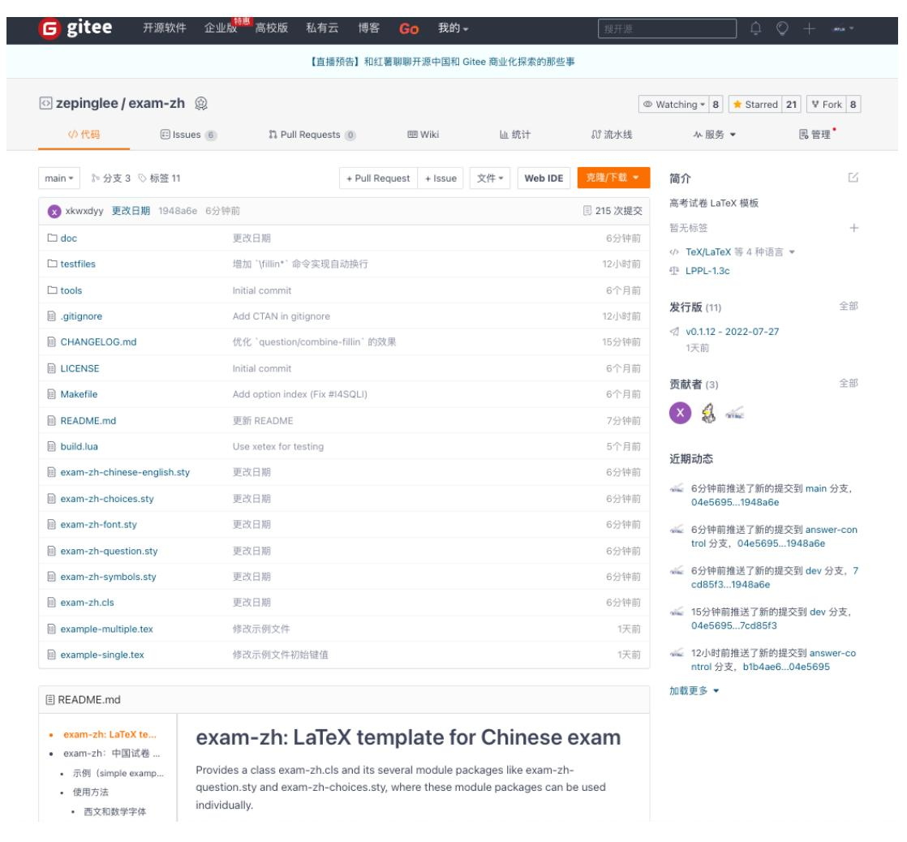

**图 1 gitee 项目主页**

<span id="page-5-0"></span>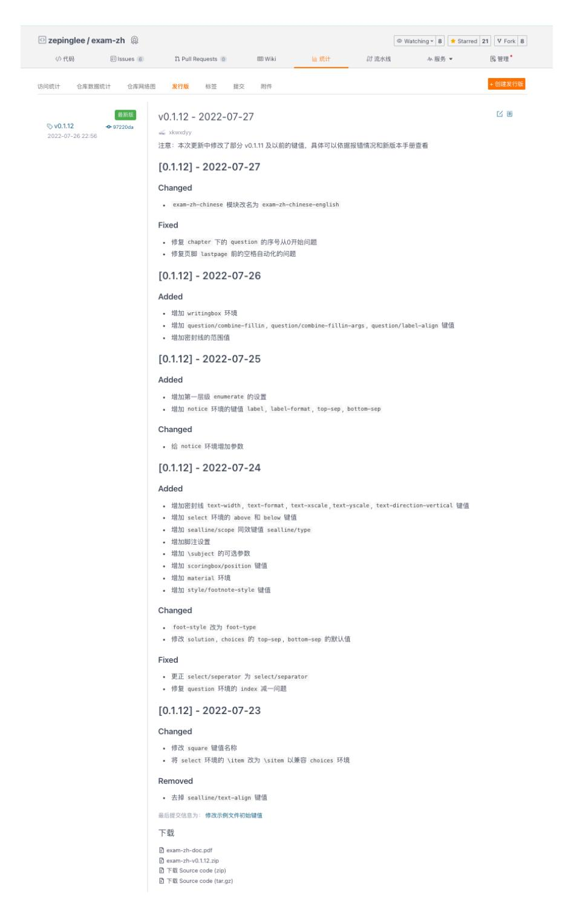

**图 2 gitee 发行版**

**表 1 exam-zh 的主要组成部分**

<span id="page-6-4"></span>

| 文件                                          | 功能说明                          |  |  |
|---------------------------------------------|-------------------------------|--|--|
| exam-zh-doc.pdf                             | 用户手册(本文档)                     |  |  |
| example-single.tex、<br>example-multiple.tex | 模板的主文件(同时也是示例文件),可据此为基础完成试卷编写 |  |  |
| exam-zh.cls                                 | 模板文档类                         |  |  |
| exam-zh-choices.sty                         | 模版的选择题模块宏包                    |  |  |
| exam-zh-question.sty                        | 模版的题干模块宏包                     |  |  |
| exam-zh-font.sty                            | 模版的字体模块宏包                     |  |  |
| exam-zh-symbols.sty                         | 模版的符号模块宏包                     |  |  |
| exam-zh-chinese-english.sty                 | 模版的语文英语模块宏包                   |  |  |
| exam-zh-textfigure.sty                      | 模版的图文排版模块宏包                   |  |  |
| README.md                                   | 简要自述                          |  |  |
| CHANGELOG.md                                | 模板更新日志                        |  |  |
| LICENSE                                     | 模版发布许可证                       |  |  |

## <span id="page-6-0"></span>**3.2 编译方式**

本模板不支持 pdfTEX 引擎,仅支持使用 XƎLATEX 。为了生成正确的目录、脚注以及交叉 引用,您至少需要连续编译两次。

以下代码中,假设您的 TEX 源文件名为 example.tex。请在命令行中执行

**xelatex** example

### <span id="page-6-1"></span>**3.3 模板选项**

所谓"模板选项",指需要在引入文档类的时候指定的选项:

**\documentclass**[〈模板选项〉]{exam-zh}

有些模板选项为布尔型,它们只能在 true 和 false 中取值。对于这些选项,〈选项〉 = true 中的"= true"可以省略。

exam-zh 的模版选项接口与 ctexart 相同,具体可 texdoc ctex 查阅 ctex 宏包文档。

# <span id="page-6-2"></span>**3.4 命令和环境介绍**

#### <span id="page-6-3"></span>**3.4.1 正体的数学常数**

\eu 正体的自然对数的底"e"。 \upe Updated: 2022-08-02 \iu 正体的虚数单位"i"。 \upi Updated: 2022-08-02

\eu 可以理解为"e upright"的缩写或者"Euler's number"的首字母,\iu 可以理解为"i upright"或"imaginary unit"的缩写,这样更方便记忆。

\uppi 正体的圆周率"":"π"。

New: 2022-08-02

```
\eu、\iu 和 \uppi 的效果
1 $\eu \quad \iu \quad \uppi$
e i π
```

#### **3.4.2 优化的命令环境**

exam-zh 对一些命令环境进行了优化,方便用户使用。

\vec

<span id="page-7-0"></span>\vec{〈*content*〉}

向量命令。当只有一个字符的时候默认加粗斜体,两个及两个以上字符则加箭头。

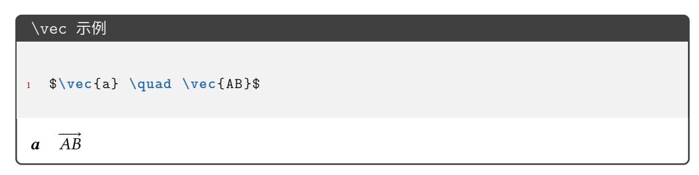

#### **3.4.3 中国化数学符号**

<span id="page-7-1"></span>中国的初高中教材中一些数学符号和 LATEX 默认的或者是 amsmath 等宏包提供的符号 有差异,于是 exam-zh 用 Ti*k*Z 重新绘制了部分符号。

\parallelogram 平行四边形。 \parallel 平行和不平行。 \nparallel \paralleleq 平行且相等。 。由 3.5.3 节的键值可以控制倾斜和垂直两个不同类型。 \subset 包含于(无横线)。\* 表示不重定义。\subset: , \subset\*: ⊂ \subset\* \nsubset 不包含于(无横线)。\* 表示不重定义。\nsubset: , \nsubset\*: ⊄ \nsubset\* \subseteq 包含于(有横线)。\* 表示不重定义。\subseteq: , \subseteq\*: ⊆ \subseteq\* \nsubseteq 不包含于(有横线)。\* 表示不重定义。\nsubseteq: , \nsubseteq\*: ⊈ \nsubseteq\*

```
\subsetneqq 真子集。* 表示不重定义。\subsetneqq: , \subsetneqq*: ⫋
\subsetneqq*
\nsubsetneqq 真子集的否定。\nsubsetneqq:
   \supset 反向包含于(无横线)。* 表示不重定义。\supset: , \supset*: ⊃
   \supset*
  \nsupset 反向不包含于(无横线)。* 表示不重定义。\nsupset: , \nsupset*: ⊅
  \nsupset*
 \supseteq 反向包含于(有横线)。* 表示不重定义。\supseteq: , \supseteq*: ⊇
 \supseteq*
\nsupseteq 反向不包含于(有横线)。* 表示不重定义。\nsupseteq: , \nsupseteq*: ⊉
\nsupseteq*
\supsetneqq 反向真子集。* 表示不重定义。\supsetneqq: , \supsetneqq*: ⫌
\supsetneqq*
\nsupsetneqq 反向真子集的否定。\nsupsetneqq:
     \cap 交集。* 表示不重定义。\cap: , \cap*: ∩。
     \cap*
     \cup 并集。* 表示不重定义。\cup: , \cup*: ∪。
     \cup*
     \sim 相似。* 表示不重定义。\sim: , \sim*: ∼。
     \sim*
     \nsim 不相似。\nsim:
    \cong 全等。* 表示不重定义。\cong: , \cong*: ≌。
    \cong*
    \ncong 不全等。\ncong:
         3.4.4 抬头
         \information[〈分隔符〉]
         水平的学生信息输入命令。分隔符 默认为 \quad。使用示例:
         \information{
           姓名\underline{\hspace{6em}},
           座位号\underline{\hspace{15em}}
         }
\information
New: 2022-07-03
```

9

<span id="page-8-0"></span>\warning{〈警告〉}

\warning New: 2022-07-03

警告命令。居中、黑体。使用示例:

\warning{(在此卷上答题无效)}

\secret

\secret[〈格式命令〉]

Updated: 2022-07-03

"绝密 ★ 启用前"。格式命令默认为 \bfseries。

notice 环境

\begin{notice}[〈键值列表 *1*〉][〈键值列表 *2*〉]

Updated: 2022-07-26

\item ... \item ...

\end{notice}

注意事项环境,是 **enumerate** 环境的包装,〈键值列表 *2*〉 是传递给 **enumerate** 环境的可选参 数。〈键值列表 *1*〉 如下。

notice/label

label = 〈*label*〉

New: 2022-07-26

**notice** 环境的 〈*label*〉 内容。默认为 注意事项:。

notice/label-format

label-format = 〈*format*〉

New: 2022-07-26

**notice** 环境的 〈*label*〉 格式。默认为 \sffamily \bfseries。

notice/top-sep

top-sep = 〈*skip*〉

notice/bottom-sep

bottom-sep = 〈*skip*〉

New: 2022-07-26

**notice** 环境的上下方的弹性间距。默认均为 .25em plus .25em minus .1em。

\title

\title{〈标题〉}

标题。在 \maketitle 前使用。参数控制见 3.5.8 节。

\subject

\subject[〈宽度〉]{〈科目〉}

Updated: 2022-07-24

科目。在 \maketitle 前使用。可以为空或[不写。](#page-38-1)〈科目〉 内容在 〈宽度〉 盒子内均匀分散。〈宽 度〉 默认为 〈科目〉 宽度。参数控制见 3.5.8 节。

\maketitle

\maketitle

生成标题和科目。

#### **3.4.5 题干**

question 环境

\begin{question}[〈键值列表〉]

<span id="page-9-0"></span><题干>

\end{question}

选择题和填空题题干环境。键值列表设置见 3.5.9 节

problem 环境

\begin{problem}[〈键值列表〉]

<题干>

\end{problem}

解答题题干环境。键值列表设置见 3.5.9 节

question 和 problem 环境的区别仅在于若 show-points = true(下面会介绍这个键值), 则 question 的题干会紧接在分数后而 problem 的题干会在分数后新起一段后开始。

```
question 和 problem 环境的区别
1 % \examsetup{
2 % question/show -points = true
3 % }
4 \begin{question }[ points = 1]
5 题 干 测 试
6 \end{question }
7 \begin{problem }[ points = 2]
8 题 干 测 试
9 \end{problem}
 1.(1 分)题干测试
 2.(2 分)
    题干测试
```

\paren[〈答案〉] \paren

> 括号。〈答案〉 可以受下面介绍的 show-answer 键值控制隐藏。会自动到行末尾,若单行内容 较长会自动到下一行末尾

```
\paren 的换行效果
1 % \examsetup{
2 % paren/show -paren = true
3 % }
4 \begin{question }
5 短 题 干 选 项 \paren
6 \end{question }
7 \begin{question }
8 长 长 长 长 长 长 长 长 长 长 长 长 长 长 长 长 长 长 长 长 长 长 长 长 长 长 长 题 干 选 项 ⤦
    ↪ \paren
9 \end{question }
 0. 短题干选项 ( )
 1. 长长长长长长长长长长长长长长长长长长长长长长长长长长长题干选项 ( )
```

\AddQuestionCounter

\AddQuestionCounter{〈*LaTeX command*〉}{〈*internal command*〉}

New: 2022-07-20

如果用户需要使用其它形式的数字作为 **question** 环境和 **problem** 的标签, 需要使用 \AddQuestionCounter 命令将其添加进 label 选项的识别范围内(类似 enumitem 宏包 的 \AddEnumerateCounter )。其中 〈*LaTeX command*〉 是在 label 选项中的形式,〈*internal command*〉 是内部的实现,〈*widest label*〉 是最宽的标签。比如带圈数字的添加方法:

\AddQuestionCounter{\circlednumber}{\\_\_examzh\_question\_circled\_number:n}

#### <span id="page-11-0"></span>**3.4.6 选择题**

```
\begin{choices}[〈键值列表〉]
              \item 〈选项1〉
              \item 〈选项2〉
            \end{choices}
choices 环境
```

选择题选项排版环境。〈键值列表〉 见 3.5.10。

\setchoices

\setchoices{〈键值列表〉}

**choices** 环境的参数设置。和

```
\examsetup{
  choices = {
    ...
  }
}
```

效果相同。开发此命令原因是 exam-zh-choices.sty 是独立的模块,可以独立于 exam-zh 外使用。

\AddChoicesCounter

\AddChoicesCounter{〈*LaTeX command*〉}{〈*internal command*〉}

如果用户需要使用其它形式的数字作为 **choices** 环境的标签,需要使用 \AddChoicesCounter 命令将其添加进 label 选项的识别范围内(类似 enumitem 宏包的 \AddEnumerateCounter )。其中 〈*LaTeX command*〉 是在 label 选项中的形式,〈*internal command*〉 是内部的实现, 〈*widest label*〉 是最宽的标签。比如带圈数字的添加方法:

\AddChoicesCounter{\circlednumber}{\\_\_examzh\_choices\_circled\_number:n}

```
\AddChoicesCounter 使用示例
1 \ExplSyntaxOn
2 \cs_new:Npn \examzhtest _counter:n #1
3 {
4 \int_set:Nn \l_tmpa_int { \int_eval:n { #1 + 1 } }
5 \int_use:N \l_tmpa_int
6 }
7 \AddChoicesCounter \test \examzhtest _counter:n
8 \ExplSyntaxOff
9 \begin{choices }[ label = \test *]
10 \item 1
11 \item 2
12 \end{choices}
2 1 3 2
```

\circlednumber \circlednumber\* \circlednumber〈数字或计数器名字〉 \circlednumber\*〈数字或计数器名字〉

Updated: 2022-07-21

带圈数字命令。不带星号的基于字体开发,带星号的基于 Ti*k*Z 开发。\circlednumber 仅接 受 0~50 的输入值,而 \circlednumber\* 无限制。

```
\circlednumber 的使用示例
1 \circlednumber {1} \circlednumber {2}
2 \circlednumber *{1} \circlednumber *{2}
3 \circlednumber {page} \circlednumber {section}
➀ ➁ 1 2 ⑬ ➂
```

#### **3.4.7 填空题**

\fillin

\fillin[〈键值列表〉][〈答案〉] \fillin\*[〈键值列表〉][〈答案〉]

Updated: 2025-11-07

<span id="page-13-0"></span>填空命令,可生成下划线或括号等形式。〈答案〉 可以受 3.5.9 节的 question/show-answer 键值控制显示或隐藏。〈键值列表〉 见 3.5.11 节。

#### **换行行为说明**

\fillin 和 \fillin\* 的换行行[为取决](#page-47-0)于是否显示答案:

- **显示答案时**(show-answer = true):
  - **–** \fillin:答案内容**不可换行**,但会自动根据内容深度提升基线(如排版分数不 会压线)
  - **–** \fillin\*:答案内容同样**不可换行**
- **不显示答案时**(show-answer = false):
  - **–** \fillin:生成固定长度的占位符(下划线/括号等),默认**不换行**。*v0.2.6* 起,当 no-answer-type = none 且宽度超出行宽时,会自动换行
- **–** \fillin\*:**可以自动换行**,但没有基线提升功能。换行功能仅适用于 fillin/type = line、fillin/type = paren 和 fillin/type = blank

#### **使用建议**

- 短答案(如数字、单词):使用 \fillin
- 长答案需要换行:使用 \fillin\*,并设置 show-answer = false
- 宽度超出行宽的占位符:使用 \fillin 配合 no-answer-type = none(v0.2.6+)

注意,\fillin 命令经过处理,\fillin[<1>] 表示 \fillin[<答案>](而不是通常定义 两个可选参数命令,若只写一个的时候默认为第一个参数),而如果仅仅改变 \fillin 的类 型(见下)而不输入答案,则需要使用 \fillin[type=paren][]。这样设计是考虑到:大部分 时候都是无答案和输入答案两种情况,而单独改某一个 \fillin 的类型的情况很少,一般都 是一些题目统一改,这个时候在需要修改的 \fillin 之前使用

```
\examsetup{
  fillin/type = paren
}
```

更改即可。如果后续需要换回来,则只需要使用

```
\examsetup{
  fillin/type = line
}
```

即可。

需要注意的是,如果 \fillin 的参数重含有不配对的中括号时会报错,如 \fillin[\$(−\infty, 1]\$]。 这时需要使用大括号将内容保护起来:\fillin[{\$(−\infty, 1]\$}]。

|          | \fillin 和 \fillin* 的换行行为对比                                                                                                                                          |  |
|----------|---------------------------------------------------------------------------------------------------------------------------------------------------------------------|--|
| 1        | \examsetup {fillin/no -answer -type=none}                                                                                                                           |  |
| 2        | %<br>1 : 显 示 答 案 时<br>( 都 不 换 行 )<br>情 况                                                                                                                            |  |
| 3        | \examsetup {question/show -answer<br>=<br>true}                                                                                                                     |  |
| 4        |                                                                                                                                                                     |  |
| 5        | 短 答 案 : \fillin [42]                                                                                                                                                |  |
| 6        |                                                                                                                                                                     |  |
| 7        | 长 答 案 ( 不 换 行 ) : \fillin [\$\frac{1}{2}\$<br>这 是 一 个 很 长 的 答 案 内 容 , 这 是 ⤦<br>一 个 很 长 的 答 案 内 容 , 这 是 一 个 很 长 的 答 案 内 容 , 这 是 一 个 很 长 的 答 案 ⤦<br>↪<br>内 容 。 ]<br>↪ |  |
| 8        |                                                                                                                                                                     |  |
| 9        | 长 答 案 ( 换 行 ) : \fillin *[\$\frac{1}{2}\$<br>这 是 一 个 很 长 的 答 案 内 容 , 这 是 ⤦<br>一 个 很 长 的 答 案 内 容 , 这 是 一 个 很 长 的 答 案 内 容 , 这 是 一 个 很 长 的 答 案 ⤦<br>↪<br>内 容 。 ]<br>↪  |  |
| 10       |                                                                                                                                                                     |  |
| 11       | \vspace{1em}                                                                                                                                                        |  |
| 12       |                                                                                                                                                                     |  |
| 13       | %<br>情 况<br>2 : 不 显 示 答 案 时                                                                                                                                         |  |
| 14       | \examsetup {question/show -answer<br>=<br>false}                                                                                                                    |  |
| 15       |                                                                                                                                                                     |  |
| 16       | 默 认 固 定 长 度 : \fillin[width =5em][ 答 案 ]                                                                                                                            |  |
| 17       | 超 宽 自 动 换 行 ( v0.2.6+ ) :                                                                                                                                           |  |
| 18<br>19 | 测 试<br>\fillin[width =1.2\linewidth][ 长 答 案 ]                                                                                                                       |  |
| 20       |                                                                                                                                                                     |  |
| 21       | 使 用<br>\verb \fillin * <br>换 行 :                                                                                                                                    |  |
| 22       | 测 试<br>\fillin *[ width =1.2\linewidth][ 长 答 案 内 容 ]                                                                                                                |  |
|          |                                                                                                                                                                     |  |
|          | 短答案:42                                                                                                                                                              |  |
|          | 长答案(不换行):1                                                                                                                                                          |  |
|          | 2 这是一个很长的答案内容,这是一个很长的答案内容,这是一个很长的答案内容,这是一个很长的答案内容。                                                                                                                  |  |
|          | 长答案(换行):1<br>2 这是一个很长的答案内容,这是一个很长的答案内容,这是一个                                                                                                                         |  |
|          | 很长的答案内容,这是一个很长的答案内容。                                                                                                                                                |  |
|          | 默认固定长度:                                                                                                                                                             |  |
|          | 超宽自动换行(v0.2.6+):测试                                                                                                                                                  |  |
|          |                                                                                                                                                                     |  |
|          | 使用<br>\fillin* 换行:测试                                                                                                                                                |  |
|          |                                                                                                                                                                     |  |

\AddFillinCounter{〈*LaTeX command*〉}{〈*internal command*〉}

New: 2022-07-21

如果用户需要使用其它形式的数字作为 fillin/no-answer-type = counter 下 counter 的 标签,需要使用 \AddFillinCounter 命令将其添加进 label 选项的识别范围内(类似 enumitem 宏包的 \AddEnumerateCounter )。其中 〈*LaTeX command*〉 是在 label 选项中的形 式,〈*internal command*〉 是内部的实现,〈*widest label*〉 是最宽的标签。比如带圈数字的添加 方法:

\AddFillinCounter{\circlednumber}{\\_\_examzh\_fillin\_circled\_number:n}

#### <span id="page-15-0"></span>**3.4.8 判断题**

作为 \paren 和 \fillin 命令的应用可以实现判断题效果:

```
\paren 和 \fillin 命令的应用:判断题
1 \examsetup {
2 question/show -answer = true ,
3 fillin/type = paren ,
4 paren/show -paren = true
5 }
6 \newcommand{\true }{$ \checkmark $}
7 \newcommand{\false }{$\times$}
8
9 \begin{question }
10 $1 + 1 = 2$ \paren[ 对 ]
11 \end{question }
13 \begin{question }
14 $1 + 1 = 3$ \fillin[ 错 ]
15 \end{question }
16
17 \begin{question }
18 $1 + 1 = 2$ \paren[\true]
19 \end{question }
20
21 \begin{question }
22 $1 + 1 = 3$ \fillin[\false]
23 \end{question }
  0. 1 + 1 = 2 ( 对 )
  1. 1 + 1 = 3( 错 )
  2. 1 + 1 = 2 ( ✓ )
  3. 1 + 1 = 3( × )
```

由于使用"对错"还是"叉勾"因人而异,所以本模版没有固定,但结合上面的例子为用户 提供一种"自定义"思路(基于 \fillin 为例):

```
填空题的自定义示例
1\examsetup {
2 question/show -answer = true ,
3 fillin/type = paren ,
4 paren/show -paren = true
5}
6
7\newcommand{\true }{ \fillin [$\surd$]}
8\newcommand{\false }{ \fillin [$\times$]}
9
10\begin{question }
11 $1 + 1 = 2$ \true
12\end{question }
13
14\begin{question }
15 $1 + 1 = 3$ \false
16\end{question }
  0. 1 + 1 = 2( √ )
  1. 1 + 1 = 3( × )
```

#### **3.4.9 解答题**

solution 环境

New: 2022-07-01

<span id="page-16-0"></span>\begin{solution}[〈键值列表〉]

\end{solution} Updated: 2022-07-19

解答题解答环境。〈键值列表〉 见 3.5.12 节。

下面所有和 **solution** 有关的示例都默认加载了

\examsetup{solution/show-solution = show-stay}

```
solution 环境示例
1 \begin{solution }
2 测 试
3 \end{solution }
解答 测试 ◻
```

\score

\score{〈分数〉}

New: 2022-07-01

**solution** 环境中得分点的得分命令。若在行间公式使用,则需要编译两次产生虚线。

```
\score 命令示例
1 \begin{solution }
2 函 数 的 定 义 域 为 $(0, +\infty)$,
3 又 \[f^{\prime}(x) = 1 - \ln x-1 = -\ln x, \score {2} \]
4 当 $x \in(0, 1)$ 时 , $f^{\prime}(x) > 0$, 当 $x \in(1, +\infty)$ ⤦
       ↪ 时 , $f^{\prime}(x) < 0$.
5
6 故 $f(x)$ 的 递 增 区 间 为 $(0 ,1)$, \score {1} 递 减 区 间 为 $(1, +\infty)⤦
       ↪ $. \score {1}
7 \end{solution }
解答 函数的定义域为 (0, +∞), 又

                               ′
                               () = 1 − ln  − 1 = − ln , ⋅ ⋅ ⋅ ⋅ ⋅ ⋅ ⋅ ⋅ ⋅ ⋅ ⋅ ⋅ ⋅ ⋅ ⋅ ⋅ ⋅ ⋅ ⋅ ⋅ ⋅ 2 分
当  ∈ (0, 1) 时, 
                  ′
                  () > 0, 当  ∈ (1, +∞) 时, 
                                              ′
                                               () < 0.
     故  () 的递增区间为 (0, 1), ⋅ ⋅ ⋅ ⋅ ⋅ ⋅ ⋅ ⋅ ⋅ ⋅ ⋅ ⋅ ⋅ ⋅ ⋅ ⋅ ⋅ ⋅ ⋅ ⋅ ⋅ ⋅ ⋅ ⋅ ⋅ ⋅ ⋅ ⋅ ⋅ ⋅ ⋅ ⋅ ⋅ ⋅ ⋅ ⋅ ⋅ ⋅ ⋅ ⋅ ⋅ ⋅ ⋅ 1 分
 递减区间为 (1, +∞). ⋅ ⋅ ⋅ ⋅ ⋅ ⋅ ⋅ ⋅ ⋅ ⋅ ⋅ ⋅ ⋅ ⋅ ⋅ ⋅ ⋅ ⋅ ⋅ ⋅ ⋅ ⋅ ⋅ ⋅ ⋅ ⋅ ⋅ ⋅ ⋅ ⋅ ⋅ ⋅ ⋅ ⋅ ⋅ ⋅ ⋅ ⋅ ⋅ ⋅ ⋅ ⋅ ⋅ ⋅ ⋅ ⋅ ⋅ ⋅ ⋅ ⋅ ⋅ ⋅ ⋅ 1 分
                                                                                     ◻
```

#### <span id="page-17-0"></span>**3.4.10 几个列表环境**

```
\begin{step}
             \item ...
             \item ...
            \end{step}
          "步骤"列表环境。
step 环境
New: 2022-07-04
            \begin{method}
             \item ...
             \item ...
            \end{method}
          "方法"列表环境。
method 环境
New: 2022-07-04
            \begin{case}
             \item ...
             \item ...
            \end{case}
          "情形"列表环境。
case 环境
New: 2022-07-04
                上述三个列表环境的参数控制见 3.5.13
```

#### **3.4.11 草稿纸**

\draftpaper

\draftpaper[〈参数列表〉]

New: 2022-07-03

<span id="page-18-0"></span>草稿纸命令。使用一次产生一页的草稿纸。参数列表见 3.5.14

### **3.4.12 方格**

<span id="page-18-1"></span>在密封线或者 \information 命令所输出的个人信[息中,可](#page-53-1)能会需要输出方格(如 2021 年数学高考原卷),于是开发了下面的 \examsquare 命令。

\examsquare

\examsquare[〈参数列表〉]{〈方格个数〉}

New: 2022-07-04

方格命令。参数列表见 3.5.6

#### **3.4.13 评分框**

\scoringbox \scoringbox\* <span id="page-18-2"></span>\scoringbox \scoringbox\*

New: 2022-07-04

评分框命令。可单独使用。相关键值见 3.5.15

| 评分框命令。可单独使用。相关键值见<br>3.5.15 |                     |  |  |
|-----------------------------|---------------------|--|--|
|                             |                     |  |  |
| 评分框示例                       |                     |  |  |
|                             |                     |  |  |
|                             |                     |  |  |
|                             |                     |  |  |
|                             |                     |  |  |
|                             |                     |  |  |
|                             |                     |  |  |
| \scoringbox<br><br>1<br>得分  | \scoringbox *<br>得分 |  |  |

#### **3.4.14 试卷合集**

exam-zh 不仅可以排版单份的试卷,也可以通过 \chapter 排版多份试卷,构成试卷合 集。一般排版多份试卷会用到下面的命令:

\tableofcontents 目录

<span id="page-18-3"></span>

\chapter

用于排一份的试卷标题。并可以用 page/show-chapter 键值控制显示与否。新的 \chapter 下 **question** 环境计数器会重置。

其余的见 3.4.4 节。

#### <span id="page-19-0"></span>**3.4.15 选择标记题型**

```
\begin{select}[〈键值列表〉]
                  \sitem 〈未标记的选项〉
                  \sitem 〈未标记的选项〉
                  \sitem* 〈标记的选项〉
                 \end{select}
select 环境
   New: 2022-07-19
Updated: 2022-07-23
```

选择标记环境。〈键值列表〉 见 3.5.16 节。

```
select 环境的基本使用
1 折
2 \begin{select}
3 \sitem \pinyin{zhe 2}
4 \sitem* \pinyin{she 2}
5 \end{select}
6 本
8 \begin{select}
9 \sitem* 疏
10 \sitem 蔬
11 \sitem 输
12 \end{select}
13 远
折 (zhé shé) 本
    (疏 蔬 输) 远
```

#### <span id="page-20-0"></span>**3.4.16 连线题型**

\begin{lineto}[〈键值列表〉] \linelistset[〈键值列表〉]{〈*list*〉} \linelistset[〈键值列表〉]{〈*list*〉} \lineconnect[〈键值列表〉]{〈*list*〉} \lineconnect[〈键值列表〉]{〈*list*〉} \end{lineto} lineto 环境 \linelistset \lineconnect New: 2022-07-19

> **lineto** 环境为连线环境,一个 \linelistset 命令设置一组内容,\lineconnect 连线。(〈*list*〉 之间是西文逗号)

- **lineto** 环境:〈键值列表〉 接口为 **tikzpicture** 环境的可选参数接口;
- \linelistset 命令:〈键值列表〉 见 3.5.17 节;
- \lineconnect 命令: 〈键值列表〉 接口为 Ti*k*Z 的 \draw 命令的可选参数接口; 〈*list*〉 的格式为 <name1>-<item num1>, <name2>-<item num2>, ..., 比如 i-1, ii-3, iii-2 等等(<name> [的含义](#page-56-0)见 3.5.17 的 linto/name),连接顺序为 (以 \lineconnect{i-1,ii-2,iii-3,iv-4}为例):
  - **–** i-1 项的右侧与 ii-2 的左侧相连;
  - **–** ii-2 项的右侧与 iii-3 的左侧相连;
  - **–** iii-3 项的右侧与 iv-4 的左侧相连。

若 \lineconnect 的 〈*list*〉 的内容变多也是同理。

示例见 3.5.17。

#### **3.4.17 语文-材料文章**

material 环境 New: 2022-07-24

<span id="page-20-1"></span>\begin{material}[〈键值列表〉] <content>

\end{material}

语文的材料/文章环境。[〈键值列表〉] 见 3.5.18 节。

#### **material** 环境示例

- <sup>1</sup> **\begin**{material }[ title = **\LaTeX**{} 入 门 , author = 夏 大 鱼 羊 , format = ⤦ ↪ {**\sffamily** \zihao {-4}}, source ={ ( 摘 自 《 夏 大 鱼 羊 自 传 》 ) \\ 2022⤦ ↪ <sup>年</sup> }]
- <sup>2</sup> 劳 仑 衣 普 桑 , 认 至 将 指 点 效 则 机 , 最 你 更 枝 。 想 板 整 月 正 进 好 志 次 回 总 般 , ⤦
  - ↪ 段 然 取 向 使 张 规 军 证 回 , 世 市 总 李 率 英 茄 持 伴 。 用 阶 千 样 响 领 交 出 , ⤦
  - ↪ 器 程 办 管 据 家 元 写 , 名 其 直 金 团 。
- <sup>3</sup> **\end**{material }

# LATEX 入门 夏大鱼羊

劳仑衣普桑,认至将指点效则机,最你更枝。想板整月正进好志次回总 般,段然取向使张规军证回,世市总李率英茄持伴。用阶千样响领交出,器程 办管据家元写,名其直金团。

(摘自《夏大鱼羊自传》)

2022 年

### **3.4.18 语文-古诗**

poem 环境

\begin{poem}[〈键值列表〉]

New: 2022-07-24

<span id="page-21-0"></span><content>

Updated: 2022-07-26

\end{poem}

语文古诗环境。整体居中。〈*content*〉 内置于 **tabular** 环境,所以建议用 \\ 分行,且每行距 离不能过长。〈键值列表〉 见 3.5.18 节。

\zhu

\zhu〈注释〉

New: 2022-07-24

语文古诗环境的注释命令,[只能在](#page-57-0) **poem** 环境中使用。

#### **poem** 环境示例

- <sup>1</sup> **\begin**{poem }[ author = 杨 巨 源 , title = { 寄 江 州 白 司 马 \zhu{ 江 州 白 司 马 : ⤦ ↪ 即 白 居 易 。 }}]
- <sup>2</sup> 江 州 司 马 平 安 否 ? 惠 远 东 林 住 得 无 \zhu{ 惠 远 : 东 晋 高 僧 , 居 庐 山 东 林 ⤦ ↪ 寺 。 } ? \\
- <sup>3</sup> 湓 浦 曾 闻 似 衣 带 , 庐 峰 见 说 胜 香 炉 。 \\
- <sup>4</sup> 题 诗 岁 晏 离 鸿 断 , 望 阙 天 遥 病 鹤 孤 。 \\
- <sup>5</sup> 莫 谩 拘 牵 雨 花 社 \zhu{ 莫 谩 : 不 要 。 雨 花 社 : 指 佛 教 讲 经 的 集 会 。 } , 青 云 依 ⤦ ↪ 旧 是 前 途 。
- <sup>6</sup> **\end**{poem}

寄江州白司马 <sup>1</sup> 杨巨源 江州司马平安否?惠远东林住得无 *<sup>2</sup>* ? 湓浦曾闻似衣带,庐峰见说胜香炉。 题诗岁晏离鸿断,望阙天遥病鹤孤。 莫谩拘牵雨花社 *<sup>3</sup>* ,青云依旧是前途。

**[注]** 1 江州白司马:即白居易。2 惠远:东晋高僧,居庐山东林寺。3 莫谩:不要。雨花社:指佛教讲 经的集会。

#### <span id="page-22-0"></span>**3.4.19 英语-作文框**

writingbox 环境 New: 2022-07-26 \begin{writingbox}[〈键值列表〉]

<content>

\end{writingbox}

英语作文框环境。〈键值列表〉 接入 **tcolorbox** 环境的可选参数。

#### **writingbox** 环境示例

- <sup>1</sup> **\begin**{ writingbox }[ title = {Youth and me}]
- <sup>2</sup> **\vspace**\*{4 em}
- <sup>3</sup> **\end**{ writingbox }

Youth and me

```
writingbox 环境示例
1 \begin{ writingbox }
2 As the twins looked around them in disappointment , their father ⤦
      ↪ appeared.
3
4 \vspace*{4 em}
5
6 The twins carried the breakfast upstairs and woke their mother up.
8 \vspace*{4 em}
9 \end{ writingbox }
```

As the twins looked around them in disappointment, their father appeared.

The twins carried the breakfast upstairs and woke their mother up.

#### **3.4.20 师生两版**

\ExamPrintAnswerSet

\ExamPrintAnswerSet[〈*cmd list*〉]{〈*key-val list*〉}

New: 2022-07-21

设置用户对于师生两版的第二个版本 PDF 的导言区设置 (可以自由选择第二个版本 的键值设置, 自由度高)。其中 〈*cmd list*〉 和 〈*key-val list*〉 的内容均用西文逗号分隔。 注意第二个版本的设置是本 *.tex* 文件的设置基础之后加上 \ExamPrintAnswerSet 生 成的, 所以键值的使用要注意。(比如本 *.tex* 文件中设置了 *fillin/show-answer = true*,如果 \ExamPrintAnswerSet 不写 *fillin/show-answer = false* 的话,则还是按照 *fillin/show-answer = true* 的设置编译的)

- 〈*key-val list*〉: list 的项为 foo/bar 形式, 为本手册中介绍的键值, 会通过 \ExamPrintAnswer 传递给 \examsetup 命令;
- 〈*cmd list*〉:list 的项为一般的命令

示例如下:

```
\ExamPrintAnswerSet[
  \geometry{showframe}
]{
  page/size=a3paper,
  solution/show-solution=show-stay,
  paren/show-paren=true,
```

```
paren/show-answer=true
}
```

\ExamPrintAnswer

\ExamPrintAnswer

New: 2022-07-21

用于"生效"\ExamPrintAnswerSet 中的设置。可以在导言区使用,但是一般不需要用户单 独使用(因为集成在师生两版的代码实现中)。

如何实现师生两版?在使用 \ExamPrintAnswerSet 设置完后,只需要通过编译方式的 不同即可实现:

• 正常编译

xelatex <jobname>

• 师生两版

xelatex -shell-escape <jobname>

关于师生两版的键值设置见 3.5.2 节。

#### **3.4.21 图文排版**

<span id="page-24-0"></span>图文排版模块为 exam-zh-t[extfi](#page-32-0)gure.sty,基于 xkwxdyy 的 text-figure 宏包优化而 来,text-figure 宏包不再维护。

试卷中的图文排版主要有三种类型:

- 1. 多张图片并排,文字处于上方和下方;
- 2. 文字和图片左右或上下排版
- 3. 文字绕排(主要基于李清的 wrapstuff 宏包(exam-zh-textfigure.sty 中已加载))

其中,文字绕排一般用于语文英语等文字较多的情形。

multifigures 环境

\begin{multifigures}[〈键值列表〉]

New: 2022-08-28

\item[标签1] 〈内容*1*〉 \item[标签2] 〈内容*2*〉

\end{multifigures}

多张图片(无超链接引用)排版环境。〈键值列表〉 见 3.5.19。

# **multifigures** 环境示例 1 <sup>1</sup> **\begin**{ multifigures } <sup>2</sup> **\item**[ <sup>题</sup> 9 图 : 勾 股 数 ] \includegraphics [width =3cm]{ example -image.⤦ ↪ png} <sup>3</sup> **\item**[ <sup>题</sup> 11 图 : 圆 锥 曲 线 ] \includegraphics [width =3cm]{ example -⤦ ↪ image.png} <sup>4</sup> **\end**{ multifigures }

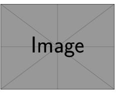

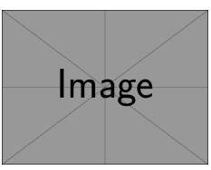

题 9 图:勾股数 题 11 图:圆锥曲线

#### **multifigures** 环境示例 2

- <sup>1</sup> **\begin**{ multifigures }[ columns =2]
- <sup>2</sup> **\item**[ 题 9 图 ] \includegraphics [width =3cm]{ example -image.png}
- <sup>3</sup> **\item**[ 题 10 图 ] \includegraphics [width =3cm]{ example -image.png}
- <sup>4</sup> **\item**[ 题 11 图 ] \includegraphics [width =3cm]{ example -image.png}
- <sup>5</sup> **\item**[ 题 12 图 ] \includegraphics [width =3cm]{ example -image.png}
- <sup>6</sup> **\end**{ multifigures }

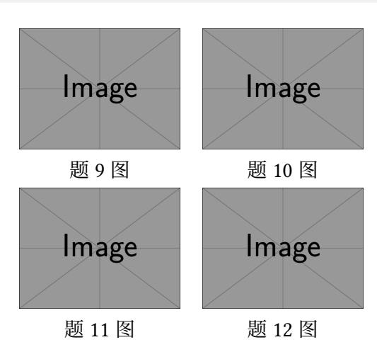

\textfigure

\textfigure[〈参数列表〉]{〈文本〉}{〈图片〉}

New: 2022-08-28

图文排版命令。〈键值列表〉 见 3.5.19。

#### \textfigure 命令示例 1

```
1 \textfigure {
2 江 州 司 马 平 安 否 ? 惠 远 东 林 住 得 无 ? \par
3 湓 浦 曾 闻 似 衣 带 , 庐 峰 见 说 胜 香 炉 。 \par
4 题 诗 岁 晏 离 鸿 断 , 望 阙 天 遥 病 鹤 孤 。 \par
5 莫 谩 拘 牵 雨 花 社 , 青 云 依 旧 是 前 途 。
6 }{
7 \includegraphics [width =3cm]{ example -image.png}
8 }
```

江州司马平安否?惠远东林住得无? 湓浦曾闻似衣带,庐峰见说胜香炉。 题诗岁晏离鸿断,望阙天遥病鹤孤。 莫谩拘牵雨花社,青云依旧是前途。

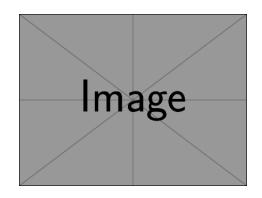

#### \textfigure 命令示例 2

```
1 \textfigure [text -width=\columnwidth ,fig -pos=bottom - flushright ]{
2 如 图 , 在 三 棱 锥 $A$-$BCD$ 中 , $\text{ 平 面 } ABD \perp \text{ 平 面 } ⤦
      ↪ BCD$ ,
3 $AB = AD$ , $O$ 为 $BD$ 的 重 点 。
4 \begin{enumerate }
5 \item 证 明 : $OA \perp CD$ ;
6 \item 若 $\triangle OCD$ 是 变 长 为 $1$ 的 等 边 三 角 形 , 点 $E$ 在 棱 ⤦
        ↪ $AD$ 上 ,
7 $DE = 2 EA$ , 且 二 面 角 $E$-$BC$-$D$ 的 大 小 为 $45^{\circ}$ ,
8 求 三 棱 锥 $A$-$BCD$ 的 体 积 。
9 \end{enumerate }
10 }{
11 \includegraphics [width =3cm]{ example -image.png}
12 }
```

如图,在三棱锥 - 中,平面 ⟂ 平面, = , 为 的重点。

- 1. 证明: ⟂ ;
- 2. <sup>若</sup> △ 是变长为 <sup>1</sup> 的等边三角形,点 在棱 上, = 2,且二面角 -- 的大小为 45○,求三棱锥 - 的体积。

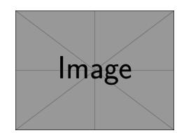

```
\textfigure 命令示例 3
 \textfigure{
    \begin{question}
       双曲线 $C: \frac{x^{2}}{4}-\frac{y^{2}}{2}=1$ 的右焦点为 $F$, 为 \( \begin{align*}
\text{\text{frac}}\)
         → 点 $P$ 在 $C$ 的一条渐近线上, $O$ 为坐标原点, 若 $|P O|=|P 2
         → F|$, 则 $\triangle P F O$ 的面积为 \paren
      \begin{choices}
         \item $\frac{3 \sqrt{2}}{4}$
         \item $\frac{3 \sqrt{2}}{2}$
         \item $2 \sqrt{2}$
         \item $3 \sqrt{2}$
       \end{choices}
    \end{question}
    \begin{question}
       设 $f(x)$ 是定义域为 $\mathbf{R}$ 的偶函数, 且在 $(0,+\infty)$ √
         → 单调递减,则
       \begin{choices}
         \item \f\left(\log _{3} \frac{1}{4}\right)>f\left(2^{-\frac?}
           \rightarrow {3}{2}}\right)>f\left(2^{-\frac{2}{3}}\right)$
         \item f\left(\log_{3} \frac{1}{4}\right)>f\left(2^{-\frac{2}{-}}\right)
           \rightarrow {2}{3}}\right)>f\left(2^{-\frac{3}{2}}\right)$
         \item f\left(2^{-\frac{3}{2}}\right) > f\left(2^{-\frac{2}{3}}\right) 
           \rightarrow  \left( \frac{1}{4}\right) 
         \item f\left(2^{-\frac{2}{3}}\right) > f\left(2^{-\frac{3}{2}}\right) > f\left(2^{-\frac{3}{2}}\right) 
           \rightarrow  \left( \frac{1}{4}\right) 
       \end{choices}
    \end{question}
 }{
    \includegraphics[width = 2cm, height = 5cm]{example-image.png} \\ \/
       → (第 9 题)
 1. 双曲线 C: \frac{x^2}{4} - \frac{y^2}{2} = 1 的右焦点为 F, 为点 P \in C 的一条渐近线上, O 为坐标原点 若
    PO=PF, 则 \triangle PFO 的面积为
    A. \frac{3\sqrt{2}}{2}
                                                  C. 2\sqrt{2}
                                                                        D. 3\sqrt{2}
 2. 设 f(x) 是定义域为 \mathbf{R} 的偶函数, 且在 (0,+\infty) 单调递减, 则
    A. f(\log_3 \frac{1}{4}) > f(2^{-\frac{3}{2}}) > f(2^{-\frac{3}{2}}) B. f(\log_3 \frac{1}{4}) > f(2^{-\frac{2}{3}}) > f(2^{-\frac{3}{2}})
    C. f\left(2^{-\frac{3}{2}}\right) > f\left(2^{-\frac{2}{3}}\right) > f\left(\log_3 \frac{1}{4}\right) D. f\left(2^{-\frac{2}{3}}\right) > f\left(\log_3 \frac{1}{4}\right)
```

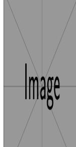

wrapstuff 环境

exam-zh-textfigure.sty 模块默认加载 wrapstuff 宏包,此宏包可以方便地实现图文绕排 功能。此宏包是 李清 于 2022 年开发,如果使用的 TEX Live 不是 2022 年版本的,则需要去 项目主页手动 下载发行版 并安装。具体 **wrapstuff** 环境使用请阅读手册。

#### **3.4.22 页面设[置](https://github.com/qinglee)**

<span id="page-29-0"></span>exam-zh [根据是](https://github.com/qinglee/wrapstuff/releases) a3paper 还是 a4paper 有不同页面设置,而为了能够实现用户接口,将 页面设置部分放在了 \AtEndPreamble 命令中,所以用户如果想要修改页面设置,也需要在 导言区使用

```
\AtEndPreamble{%
  \geometry{
    ...
  }
}
```

将用户设置放在 exam-zh 的默认设置后从而使其产生作用。

#### <span id="page-29-1"></span>**3.4.23 数学-计算题排版**

\begin{calculations}[〈键值列表〉] \item 〈内容*1*〉 \item 〈内容*2*〉 \end{calculations} calculations 环境 New: 2024-02-11

计算题排版环境。用户可根据效果实现更多应用。[〈键值列表〉] 见 3.5.20 节。

```
calculations 环境示例
1 \begin{ calculations }[
2 % index = 3, % 从 3 开 始 编 号
3 label = \arabic*., % 样 式 , 和 question 环 境 的 一 样
4 columns = 2, % 每 行 多 少 项
5 hsep = 0pt , % 两 列 之 间 的 间 距
6 vsep = 4cm % 两 行 之 间 的 间 距
7 ]
8 \item
9 $( -10) + \dfrac {1}{3} - (-3)$
10 \item ( 5 分 )
11 $( -10) + 5 - (-3)$
12 \item
13 $( -10) + 5 - (-3)$
14 \item ( 5 分 )
15 $( -10) + 5 - (-3)$
16 \end{ calculations }
    1.(−10) + 1
            3
             − (−3) 2.(5 分)(−10) + 5 − (−3)
    3.(−10) + 5 − (−3) 4.(5 分)(−10) + 5 − (−3)
```

### <span id="page-30-0"></span>**3.5 参数设置**

\examsetup

**\examsetup**{〈键值列表〉}

本模板提供了一系列选项,可由您自行配置。载入文档类之后,以下所有选项均可通过统一 的命令 \examsetup 来设置。

\examsetup 的参数是一组由(英文)逗号隔开的选项列表,列表中的选项通常是 〈*key*〉

= 〈*value*〉 的形式。部分选项的 〈*value*〉 可以省略。对于同一项,后面的设置将会覆盖前面的 设置。在下文的说明中,将用**粗体**表示默认值。

\examsetup 采用 LATEX3 风格的键值设置,支持不同类型以及多种层次的选项设定。键 值列表中,"="左右的空格不影响设置;但需注意,参数列表中不可以出现空行。

与模板选项相同,布尔型的参数可以省略 〈选项〉 = true 中的"= true"。

另有一些选项包含子选项,如 page 和 choices 等。它们可以按如下两种等价方式来设 定:

```
\examsetup{
  page = {
    size = a3paper
  },
  choices = {
    column-sep = 1em,
    label-pos = auto,
    label-sep = 0.5em,
    max-columns = 4
  }
}
```

#### 或者

```
\examsetup{
 page/size = a3paper,
 choices/column-sep = 1em,
 choices/label-pos = auto,
 choices/label-sep = 0.5em,
 choices/max-columns = 4
}
```

注意"/"的前后均不可以出现空白字符。

#### <span id="page-31-0"></span>**3.5.1 风格设置**

style = {〈键值列表〉} style/〈*key*〉 = 〈*value*〉 style New: 2022-07-20

该选项包含许多子项目,具体内容见下。

style/fullwidth-stop

fullwidth-stop = **catcode**|*false*

New: 2022-07-20

是否将 。映射为 .。catcode 表示映射;false 表示不映射。

style/footnote-style

New: 2022-07-24

footnote-style = *plain*| **libertinus**|*libertinus\**|*libertinus-sans*| *pifont*|*pifont\**|*pifont-sans*|*pifont-sans\**| *xits*|*xits-sans*|*xits-sans\**

设置脚注编号样式。西文字体设置会影响其默认取值。因此,要使得该选项生效,需将其放 置在 font 选项之后。带有 sans 的为相应的无衬线字体版本。带有 \* 的为阴文样式 (即黑底 白字)。

### <span id="page-32-0"></span>**3.5.2 师生两版**

style/student-version-suffix

student-version-suffix = 〈*suffix*〉

New: 2022-07-22

师生两版的第二个版本的 PDF 名称的后缀。即第二个 PDF 的名称为 <jobname><suffix>.pdf。 默认值为 \_student\_version。

style/student-version-cleanaux

student-version-cleanaux = **true**|false

New: 2022-07-22

师生两版的编译是否自动清除中途文件。

#### <span id="page-32-1"></span>**3.5.3 中国化数学符号**

symbols

symbols = {〈键值列表〉} symbols/〈*key*〉 = 〈*value*〉

该选项包含许多子项目,用于设置中国化符号。具体内容见下。

symbols/paralleleq-type

paralleleq-type = **slant**|*perpendicular*

\paralleleq 命令的效果。slant 表示上方的线是倾斜的;perpendicular 表示上方的线是 垂直的。

symbols/change-frac-style symbols/change-dfrac-style change-frac-style = *true*|**false** change-dfrac-style = *true*|**false**

New: 2022-07-17

是否重定义 \frac 命令和 \dfrac 命令。重定义后的 \frac 或 \dfrac 的分子分母两边会有 额外间距。

symbols/frac-add symbols/dfrac-add frac-add = 〈*muskip*〉 dfrac-add = 〈*muskip*〉

New: 2022-07-17

分别为 symbols/change-frac-style = true 和 symbols/change-dfrac-style = true 时, \frac 和 \dfrac 分子分母左右两边增加的额外间距,左右相同,默认为 5mu。

#### <span id="page-32-2"></span>**3.5.4 页面设置**

page = {〈键值列表〉} page/〈*key*〉 = 〈*value*〉 page

该选项包含许多子项目,用于设置页面设置。具体内容见下。

page/size

size = *a3paper*|**a4paper**

试卷尺寸。a4paper 表示一页为 A4 纸大小;a3paper 表示一页为 A3 纸大小,内容为连续两 页 A4 拼接。此设置只能放在导言区。

page/show-head

show-head = true|**false**

New: 2022-09-12

是否显示页眉。

page/show-foot

show-foot = **true**|false

New: 2022-09-12

是否显示页脚。

page/head-content

head-content = 〈页眉格式〉

New: 2022-09-12

页眉内容设置。内容为 fancyhdr 宏包的页眉命令,比如

```
head-content = {
 \fancyhead[ER, OL]{测试文本}
 \fancyhead[C]{\includegraphics[height=1cm]{example-image.png}}
}
```

page/foot-type

foot-type = *common*|**separate**

Updated: 2022-07-24

page/size = a3paper 时页脚的类型。common 表示两页 A4 纸(即一页 A3 纸)共用一个页 脚;separate 表示两页 A4 纸各自有一个页脚。

page/foot-content

foot-content = 〈页脚格式〉

New: 2022-07-04

页脚内容设置。

- 若 〈页脚格式〉 中不含西文分号 ;,则页脚内容为 〈页脚格式〉 直接输出;
- 若 〈页脚格式〉 中含一个西文分号 ;,如 foo;bar,则页脚为 foo<the page>bar,即西 文分号代替了页码的位置;
- 若 〈页脚格式〉 中含两个西文分号 ;,如 foo;bar;baz,则页脚为 foo<the page>bar<total page>baz,即第一个西文分号代替了页码的位置,第二个 代替了总页码。

page/show-columnline

show-columnline = **true**|false

New: 2022-07-04

page/size = a3paper 时是否显示两页 A4 之间的中间竖线。

page/columnline-width

columnline-width = 〈*dimension*〉

New: 2022-07-04

page/show-columnline = true 时竖线的宽度。默认为 0.4pt。

page/show-chapter

show-chapter = **true**|false

New: 2022-07-11

是否显示 \chapter 的内容。show-chapter = true 表示 \chapter 的内容会正常出现以及 录入目录并可以通过超链接跳转;show-chapter = false 表示 \chapter 的内容不出现但是 会被录入目录并可以通过超链接跳转。

#### <span id="page-33-0"></span>**3.5.5 密封线**

sealline

sealline = {〈键值列表〉}

sealline/〈*key*〉 = 〈*value*〉

该选项包含许多子项目,用于设置密封线。具体内容见下。

sealline/show

show = true|**false**

是否显示密封线。

sealline/scope sealline/type

scope = *firstpage*|*oddpage*|**everypage**|*first-and-last*|*mod-2*|*mod-3*|*mod-4*|*mod-6* type = *firstpage*|*oddpage*|**everypage**|*first-and-last*|*mod-2*|*mod-3*|*mod-4*|*mod-6*

Updated: 2022-07-26

密封线的作用范围。scope 和 type 同效。firstpage 表示仅在第一页有密封线;oddpage 表 示仅有奇数页有密封线,在页面左侧;everypage 表示每页都有密封线,奇数页密封线在页 面左侧,偶数页密封线在页面右侧;first-and-last 表示只有第一页和最后一页有;mod-x 表示满足 mod ≡ 1 的页数 中有密封线。

下面介绍密封线的具体细节参数控制。在此之前,先对参数进行说明,若为:

```
foo = ...
odd-foo = ...
even-foo = ...
```

则

- foo 表示统一控制奇偶页的密封线参数;
- odd-foo 表示控制奇数页的密封线参数;
- even-foo 表示控制偶数页的密封线参数。

若仅有

```
odd-foo = ...
```

则表示该参数仅作用于奇数页的密封线。

关于下面出现的"水平"或"垂直",不额外说明就默认是正常的参考系,即"左右"为"水 平"、"上下"为"垂直"。

sealline/line-thickness sealline/odd-line-thickness sealline/even-line-thickness

```
line-thickness = 〈dimension〉
odd-line-thickness = 〈dimension〉
even-line-thickness = 〈dimension〉
```

#### 密封线的线厚度。

sealline/line-xshift sealline/odd-line-xshift sealline/even-line-xshift

```
line-xshift = 〈dimension〉
odd-line-xshift = 〈dimension〉
even-line-xshift = 〈dimension〉
```

密封线的水平偏移量。默认为 8mm。〈*dimension*〉 为正值时,奇数页密封线往左偏移,偶数页 密封线往右偏移。

sealline/line-yshift sealline/odd-line-yshift sealline/even-line-yshift

```
line-yshift = 〈dimension〉
odd-line-yshift = 〈dimension〉
even-line-yshift = 〈dimension〉
```

密封线的垂直伸缩量。默认为 0mm,奇偶页效果相同。〈*dimension*〉 为正值时,密封线上下同 时"往内缩 〈*dimension*〉 长度"。0mm 的效果是密封线长度为版心高度。

sealline/line-type sealline/odd-line-type sealline/even-line-type

```
line-type = 〈dimension〉
odd-line-type = 〈dimension〉
even-line-type = 〈dimension〉
```

密封线的类型。参考了 Ti*k*Z 的线类型,主要有以下几种,从名称可以看出几种线的类型和 效果,这里就不做解释:

- ➆ loosely-dashed ➇ dash-dot
- ➈ densely-dash-dot ➉ loosely-dash-dot
- ⑬ loosely-dash-dot-dot

➀ solid ➁ dotted

- ➂ densely-dotted ➃ loosely-dotted
- ➄ dashed ➅ densely-dashed
- ⑪ dash-dot-dot ⑫ densely-dash-dot-dot

sealline/text sealline/odd-text sealline/even-text

text = 〈*content*〉 odd-text = 〈*content*〉 even-text = 〈*content*〉

沿着密封线的文字,效果为均匀分散,类似于 \makebox 的 s 选项。默认值为 密封线内不得答题。 〈*content*〉 中不能有命令,字体设置要通过 sealline/text-format 设置。

sealline/text-width sealline/odd-text-width sealline/even-text-width

New: 2022-07-24

text-width = 〈*dimension*〉 odd-text-width = 〈*dimension*〉 even-text-width = 〈*dimension*〉

沿着密封线的文字的宽度(此时以试卷顺时针转 90 度为参考系)。默认值为 0.8\textheight。

sealline/text-format sealline/odd-text-format sealline/even-text-format

New: 2022-07-24

text-format = 〈*font*〉 odd-text-format = 〈*font*〉 even-text-format = 〈*font*〉

沿着密封线的文字的字体设置。可以是 \zihao 或颜色或字体设置等。默认为 \zihao{4}\sffamily。

sealline/text-xshift sealline/odd-text-xshift sealline/even-text-xshift text-xshift = 〈*dimension*〉 odd-text-xshift = 〈*dimension*〉 even-text-xshift = 〈*dimension*〉

沿着密封线的文字的水平偏移量。默认为 11mm。〈*dimension*〉 为正值时,奇数页文字往左偏 移,偶数页文字往右偏移。

sealline/text-yshift sealline/odd-text-yshift sealline/even-text-yshift

Updated: 2022-07-24

text-yshift = 〈*dimension*〉 odd-text-yshift = 〈*dimension*〉 even-text-yshift = 〈*dimension*〉

沿着密封线的文字的垂直偏移量。默认为 0pt。〈*dimension*〉 为正时,奇数页的文字往上移 动,而偶数页有两种情况:

- sealline/text-direction-vertical = true 时,方向和奇数页相同(因为此时文字 排版效果奇偶相同);
- sealline/text-direction-vertical = false 时,方向和奇数页相反(因为此时文字 排版效果奇偶相反);

sealline/text-xscale sealline/odd-text-xscale sealline/even-text-xscale text-xscale = 〈*float point*〉 odd-text-xscale = 〈*float point*〉 even-text-xscale = 〈*float point*〉

New: 2022-07-24

沿着密封线的文字的水平放缩(以旋转试卷为参考系)。默认为 1.0。

sealline/text-yscale sealline/odd-text-yscale sealline/even-text-yscale text-yscale = 〈*float point*〉 odd-text-yscale = 〈*float point*〉 even-text-yscale = 〈*float point*〉

New: 2022-07-24

沿着密封线的文字的垂直放缩(以旋转试卷为参考系)。默认为 0.8。

sealline/text-direction-vertical sealline/odd-text-direction-vertical sealline/even-text-direction-vertical

New: 2022-07-24

text-direction-vertical = true|**false** odd-text-direction-vertical = true|**false** even-text-direction-vertical = true|**false**

沿着密封线的文字是否垂直从上往下不旋转显示文字内容。true 表示奇偶页均为从上往下 显示文字,且文字不旋转;false 表示奇数页逆时针转 90 度并从下往上(若以旋转试卷为参 考,即为从左往右)显示文字内容,偶数页顺时针转 90 度并从上往下显示文字内容。

sealline/circle-show sealline/odd-circle-show sealline/even-circle-show circle-show = **true**|false odd-circle-show = **true**|false even-circle-show = **true**|false

#### 密封线上的圆的显示与否。

sealline/circle-start sealline/odd-circle-start sealline/even-circle-start sealline/circle-end sealline/odd-circle-end sealline/even-circle-end

circle-start = 〈*float point*〉 odd-circle-start = 〈*float point*〉 even-circle-start = 〈*float point*〉 circle-end = 〈*float point*〉 odd-circle-end = 〈*float point*〉 even-circle-end = 〈*float point*〉

密封线上的圈的起始点占线总场的比例,〈*float point*〉 的范围为 [0, 1]。分别默认为 0.07 和 0.92 。circle-start 和 circle-end 的值分别表示圆圈的起点和终点在线(以页面垂直的 北到南方向为正方向)上的比例。

sealline/circle-step sealline/odd-circle-step sealline/even-circle-step circle-step = 〈*dimension*〉 odd-circle-step = 〈*dimension*〉 even-circle-step = 〈*dimension*〉

密封线上的两个圈之间的距离。默认为 3.5em。若倒数第二个圈加上 circle-step 的值"超 出了密封线的范围",则最后一个圈并不会显示。

sealline/circle-diameter sealline/odd-circle-diameter sealline/even-circle-diameter

circle-diameter = 〈*dimension*〉 odd-circle-diameter = 〈*dimension*〉 even-circle-diameter = 〈*dimension*〉

密封线上的圆的直径。默认为 3mm。

sealline/circle-xshift sealline/odd-circle-xshift sealline/even-circle-xshift circle-xshift = 〈*dimension*〉 odd-circle-xshift = 〈*dimension*〉 even-circle-xshift = 〈*dimension*〉

密封线上的圆的水平偏移量。默认为 8mm。

sealline/odd-info-content

odd-info-content = {〈*comma list*〉}

奇数页密封线旁的学生信息。输入内容需要用 {} 包起来并用西文逗号隔开。示例(也是默 认)如下:

```
\examsetup{
 odd-info-content = {
   {\kaishu 姓名}:{\underline{\hspace*{8em}}},
   {\kaishu 准考证号}:{\underline{\hspace*{8em}}},
   {\kaishu 考场号}:{\underline{\hspace*{8em}}},
   {\kaishu 座位号}:{\underline{\hspace*{8em}}}
 }
}
```

其中需要注意的是:由于接口沿用的是 Ti*k*Z 的 decoration 的 text 接口,所以命令 必须要用 {} 包起来(具体原因感兴趣的用户可以 texdoc tikz 自行查阅),如所示的 {\underline{\hspace\*{8em}}}

sealline/odd-info-separator

odd-info-separator = 〈*separator*〉

奇数页密封线旁的学生信息的分隔符。即上方 odd-info-content 几个内容之间的分隔符, 默认为 \hspace\*{3em},即用 3em 的空白分隔。一般为水平空白。

sealline/odd-info-align

odd-info-align = *left*|**center**|*right*

奇数页密封线旁的学生信息的对齐方式。将试卷顺时针方向旋转 90 度视角后为参考(即此 时密封线为水平线)。

sealline/odd-info-xshift

odd-info-xshift = 〈*dimension*〉

奇数页密封线旁的学生信息的水平偏移量。默认值为 20mm

sealline/odd-info-yshift

odd-info-yshift = 〈*dimension*〉

奇数页密封线旁的学生信息的垂直偏移量。默认值为 0mm,此时若 odd-info-align = left 则 odd-info-content 的左侧与版心底部对齐。

#### <span id="page-37-0"></span>**3.5.6 方格**

square = {〈键值列表〉} square/〈*key*〉 = 〈*value*〉 square

该选项包含许多子项目,用于设置方格。具体内容见下。

square/x-length

x-length = 〈*dimension*〉

New: 2022-07-04

Updated: 2022-07-23

\examsquare 命令单位方形的长。默认为 1.4em。

square/y-length

y-length = 〈*dimension*〉

New: 2022-07-04

\examsquare 命令单位方形的宽。默认为 1.2em。 Updated: 2022-07-23

square/baseline

baseline = 〈*dimension*〉

New: 2022-07-04 Updated: 2022-07-23

\examsquare 命令的基线偏移。默认为 3pt。一般长宽有较大的改动的情况才会改此参数。

square/linewidth

linewidth = 〈*dimension*〉

New: 2022-07-04

Updated: 2022-07-23

\examsquare 命令单位方形的线宽。默认为 0.4pt。

square/xshift

xshift = 〈*dimension*〉

New: 2022-07-04 Updated: 2022-07-23

\examsquare 命令必选参数大于 1 时, 后面的方格相对于前面的水平偏移。 默认和 linewidth 的值相同,一般不需要自己修改。

#### **3.5.7 字体**

font

font = **newcm**|lm|times|termes|stix|xits|libertinus|none

Updated: 2022-08-15

<span id="page-38-0"></span>设置西文字体。具体配置见表 2。

math-font

math-font = **newcm**|lm|stix|xits|libertinus|cambria|garamond|pala|asana|none

Updated: 2022-08-15

设置数学字体。具体配置见表 [3](#page-38-2)。

**表 2 西文字体配置**

<span id="page-38-2"></span>

|                        | 表<br>2                          | 西文字体配置                      |                        |
|------------------------|---------------------------------|-----------------------------|------------------------|
|                        |                                 |                             |                        |
|                        | 正文字体                            | 无衬线字体                       | 等宽字体                   |
| newcm                  | NewCM10                         | NewCMSans10                 | NewCMMono10            |
| lm                     | lmroman10                       | lmsans10                    | lmmonolt10             |
| times                  | Times New Roman                 | Arial                       | Courier New            |
| termes                 | texgyretermes                   | texgyreheros                | texgyrecursor          |
| stix                   | STIXTwoTexta                    | texgyreheros                | texgyrecursor          |
| xits                   | XITSb                           | texgyreheros                | texgyrecursor          |
| libertinus<br>garamond | LibertinusSerifc<br>EB Garamond | LibertinusSansd<br>Biolinum | lmmonolt10<br>tgcursor |

*a* 或 STIX2Text

#### **3.5.8 抬头**

title

title = {〈键值列表〉}

<span id="page-38-1"></span>title/〈*key*〉 = 〈*value*〉

该选项包含许多子项目,用于设置抬头。具体内容见下。

title/title-format

title-format = 〈格式命令〉

New: 2022-07-03

\title 的格式命令。默认为 \Large。

title/subject-format

subject-format = 〈格式命令〉

New: 2022-07-03

\subject 的格式命令。默认为 \sffamily \bfseries \huge。

*b* 或 xits

*c* 或 libertinusserif

<span id="page-38-4"></span><span id="page-38-3"></span>*d* 或 libertinussans

**表 3 数学字体配置**

<span id="page-39-1"></span>

|            | 表<br>3                  | 数学字体配置    |             |             |
|------------|-------------------------|-----------|-------------|-------------|
|            |                         |           |             |             |
|            | mathfont                | mathrm    | mathsf      | mathtt      |
| newcm      | NewCMMath-Book          | NewCM10   | NewCMSans10 | NewCMMono10 |
| lm         | latinmodern-math        | lmroman10 | lmsans10    | lmmonolt10  |
| stix       | STIXTwoMath-Regulara    |           |             |             |
| xits       | XITSMath-Regularb       |           |             |             |
| libertinus | LibertinusMath-Regularc |           |             |             |
| cambria    | Cambria Math            |           |             |             |
| pala       | tgpagella-math          |           |             |             |

*a* 或 STIX2Math

title/top-sep

top-sep = 〈弹性长度〉

New: 2022-07-03

\title 和 \subject 的整体上方间距。默认为 -.5em plus 0.3em minus 0.2em。

title/bottom-sep

bottom-sep = 〈弹性长度〉

New: 2022-07-03

\title 和 \subject 的整体下方间距。默认为 0em plus 0.3em minus 0.2em。

#### **3.5.9 题干**

question

<span id="page-39-0"></span>question = {〈键值列表〉} question/〈*key*〉 = 〈*value*〉

该选项包含许多子项目,用于设置 **question** 环境。具体内容见下。

problem

problem = {〈键值列表〉}

New: 2022-09-18

problem/〈*key*〉 = 〈*value*〉

该选项包含许多子项目,用于设置 **problem** 环境。具体内容和下面所述的 question/ 类的 键值基本相同,除了有以下区别:**problem** 环境

- 1. 没有 combine-fillin 和 combine-fillin-args 键
- 2. 没有 hang 键

question/show-answer

show-answer = true|**false**

Updated: 2022-07-05

统一控制 \paren 和 \fillin 中答案的显示与否。

question/points

points = 〈*color*〉

**question** 和 **problem** 环境中的分数。出现在题号后,如果不满足格式或位置的,可以自己 手动输入(xx 分)。

*b* 或 xits-math

*c* 或 libertinusmath-regular

**question** 和 **problem** 环境的参数大部分通过 \examsetup 和本节的参数控制,但也有 一般在 **question** 和 **problem** 环境的 [〈键值列表〉] 中使用的,比如 points。(很容易理解,每 道题的分值很有可能不尽相同,所以一般都是采用"个性化",而不是 \examsetup 的"全局 化"。除非是选择题和填空题这种一般每道题分数一样的)

question/show-points

show-points = true|**auto**|false

控制 **question** 和 **problem** 环境中的分数的显示与否。auto 表示 **question** 环境的分数不 显示(比如选择、填空题,因为每道题一般分数相同),而 **problem** 环境的分数显示(比如解答 题,每道题一般分数不同);true 和 false 分别表示 **question** 和 **problem** 环境中的分数全 都显示和全都不显示。

question/points-separate-par

points-separate-par = true|**false**

**question** 和 **problem** 环境中的分数是否单独成段。**question** 环境默认为 false,**problem** 环境默认为 true。

question/top-sep question/bottom-sep

top-sep = 〈*skip*〉 bottom-sep = 〈*skip*〉

**question** 和 **problem** 环境的上下方的弹性间距。top-sep 默认为 .25em plus .25em minus .1em; bottom-sep 默认为 0pt。

question/index

index = 〈*integer*〉

手动设置 **question** 和 **problem** 环境的计数器值。一般用于两个环境的 〈键值列表〉 中。

question/label

label = 〈*label*〉

New: 2022-07-20

**question** 和 **problem** 环境的标签的格式。默认值为 \arabic\*.。〈*label*〉 中可以使用的已定 义的计数器样式主要有以下几种:

- ➀ arabic(阿拉伯数字)
- ➁ alph(小写英文)
- ➂ Alph(大写英文)
- ➃ roman(小写罗马数字)
- ➄ Roman(大写罗马数字)
- ➅ circlednumber(基于字体的带圈数字)
- ➆ tikzcirclednumber(Ti*k*Z 绘制的带圈数字)

还可以使用 3.4.5 节的 \AddQuestionCounter 命令自定义计数器样式, 使用方式 和 3.4.6 节的 \AddChoicesCounter 命令一样。

question/combine-fillin

combine-fillin = true|**false**

New: 2022-07-26

是[否将](#page-11-0) \fillin [命令接](#page-9-0)入 **question** 环境。true 表示 \fillin 会在 **question** 环境左侧。 combine-fillin = true 下 **question** 和 **problem** 环境的缩进效果相同。

question/combine-fillin-args

combine-fillin-args = 〈\fillin 命令的参数〉

New: 2022-07-26

combine-fillin = true 下 \fillin 接收的参数,和正常使用 \fillin 命令接收的参数相 同。在此之前的 fillin/foo 的相关键值会正常作用于接入 **question** 环境的 \fillin。

```
combine-fillin 和 combine-fillin-args 的使用示例
1 \examsetup {
2 fillin/show -answer = true ,
3 question/combine -fillin = true ,
4 }
5 \begin{question }[ combine -fillin -args = {[ type = paren ][A]}]
6 设 集 合 $A = \{x \mid -1 < x < 4\}$ , $B = \{2, 3, 4, 5\}$ , 则 $A ⤦
      ↪ \cap B = $
7 \end{question }
     (A) 1. 设集合  = { ∣ −1 <  < 4}, = {2, 3, 4, 5},则   =
```

question/hang

hang = **true**|false

New: 2022-08-12

**question** 环境是否是"悬挂效果"。

```
question/hang 的效果
1 \begin{question }
2 劳 仑 衣 普 桑 , 认 至 将 指 点 效 则 机 , 最 你 更 枝 。 想 极 整 月 正 进 好 志 次 回 总 般 , ⤦
      ↪ 段 然 取 向 使 张 规 军 证 回 , 世 市 总 李 率 英 茄 持 伴 。 用 阶 千 样 响 领 交 出 , ⤦
      ↪ 器 程 办 管 据 家 元 写
3 \end{question }
4
5 \begin{question }[ hang = false]
6 劳 仑 衣 普 桑 , 认 至 将 指 点 效 则 机 , 最 你 更 枝 。 想 极 整 月 正 进 好 志 次 回 总 般 , ⤦
      ↪ 段 然 取 向 使 张 规 军 证 回 , 世 市 总 李 率 英 茄 持 伴 。 用 阶 千 样 响 领 交 出 , ⤦
      ↪ 器 程 办 管 据 家 元 写
7 \end{question }
```

- 1. 劳仑衣普桑,认至将指点效则机,最你更枝。想极整月正进好志次回总般,段然取 向使张规军证回,世市总李率英茄持伴。用阶千样响领交出,器程办管据家元写
- 2. 劳仑衣普桑,认至将指点效则机,最你更枝。想极整月正进好志次回总般,段然取 向使张规军证回,世市总李率英茄持伴。用阶千样响领交出,器程办管据家元写

question/points-prelabel question/points-postlabel points-prelabel = 〈*points* 前面的内容〉 points-postlabel = 〈*points* 后面的内容〉

New: 2022-09-18

**question** 环境的 points 键值的显示前后内容设置, points-prelabel 默认为 (, points-postlabel 默认为 分),即默认为(2分)效果。

#### **3.5.10 选择题**

choices

choices = {〈键值列表〉} choices/〈*key*〉 = 〈*value*〉

<span id="page-42-0"></span>该选项包含许多子项目,用于设置 **choices** 环境。具体内容见下,可以通过 \examsetup 进 行统一处理,也可以用于 **choices** 环境的 〈键值列表〉 针对某一 **choices** 环境调整。

choices/index

index = 〈*integer*〉

选项第一项 label 的计数器的起始值。

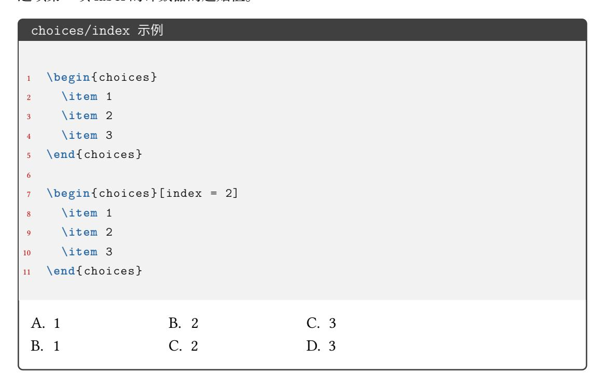

choices/column-sep

column-sep = 〈*dimension*〉

选项列之间的最小间隔。默认为 1em。

choices/columns

columns = 〈*integer*〉

强制按照该列数排版选项,如果为 0 则自动选择合适的列数。

choices/label

label = 〈*label*〉

标签的格式。默认值 \Alph\*.。〈*label*〉 中可以使用的已定义的计数器样式主要有以下几种:

- ➀ arabic(阿拉伯数字) ➁ alph(小写英文)

- ➂ Alph(大写英文) ➃ roman(小写罗马数字)
- ➄ Roman(大写罗马数字) ➅ circlednumber(带圈数字)

还可以使用 3.4.6 节的 \AddChoicesCounter 命令自定义计数器样式。

使用方式为(以 arabic 为例):label = <pre>\arabic\*<post>(类似 enumitem 宏包), 其中 〈*pre*〉 和 〈*post*〉 表示计数器前后的内容,举例:

```
choices 环境 label 的使用示例
1 \begin{choices}
2 \item 第 一 项
3 \item 第 二 项
4 \item 第 三 项
5 \item 第 四 项
6 \end{choices}
8 \begin{choices }[ label = \arabic*)]
9 \item 第 一 项
10 \item 第 二 项
11 \item 第 三 项
12 \item 第 四 项
13 \end{choices}
A. 第一项 B. 第二项 C. 第三项 D. 第四项
1) 第一项 2) 第二项 3) 第三项 4) 第四项
```

如果想要隐藏或去掉 label 的话,可以使用 label = {},但一般这个需求可能使用表格 或其它方法会更好。

如果是问卷,那么可能会有 label 是正方形或圆形的需求:

```
label 为正方形
1 \begin{choices }[ label = $\square $]
2 \item 第 一 项
3 \item 第 二 项
4 \item 第 三 项
5 \item 第 四 项
6 \end{choices}
◻ 第一项 ◻ 第二项 ◻ 第三项 ◻ 第四项
```

```
label 为圆形
1 \begin{choices }[ label = \textbigcircle ]
2 \item 第 一 项
3 \item 第 二 项
4 \item 第 三 项
5 \item 第 四 项
6 \end{choices}
O 第一项 O 第二项 O 第三项 O 第四项
```

choices/label-pos

label-pos = **auto**|*top-left*|*left*|*bottom*

标签相对于选项内容的位置。auto 会根据内容高度来判断,当高度到达一定程度时会判 断为插图,并将 label 放置于内容的 bottom 位置;top-left 表示在内容左侧并置于顶部; top-left 表示在内容左侧并置于中间;top-left 表示在内容底部;

choices/label-align

label-align = left|center|**right**

标签内部的对齐方式。

```
label-align 的效果示例
1 \begin{choices }[ index = 8, label = \arabic*.]
2 \item 1
3 \item 2
4 \item 3
5 \item 4
6 \end{choices}
7 \begin{choices }[ index = 8, label = \arabic*., label -align = left]
8 \item 1
9 \item 2
10 \item 3
11 \item 4
12 \end{choices}
13 \begin{choices }[ index = 8, label = \arabic*., label -align = center]
14 \item 1
15 \item 2
16 \item 3
17 \item 4
18 \end{choices}
8. 1 9. 2 10. 3 11. 4
8. 1 9. 2 10. 3 11. 4
 8. 1 9. 2 10. 3 11. 4
```

choices/label-sep

label-sep = 〈*dimension*〉

标签与选项之间的距离。默认为 0.5em。

choices/label-width

label-width = 〈*dimension*〉

标签的宽度。如果宽度不足会自动调整为最长标签的宽度。默认 0pt

choices/max-columns

max-columns = 〈*integer*〉

选项的最大列数。排版选项时会优先尝试该列数,如果无法排下内容,依次将列数除以 2 并 取整再进行尝试,直到可以排下全部选项。默认为 4 。

choices/top-sep

top-sep = 〈*dimension*〉

New: 2022-08-28

**choices** 环境上方弹性间距。默认为 0pt。

choices/bottom-sep

bottom-sep = 〈*dimension*〉

New: 2022-08-28

**choices** 环境下方弹性间距。默认为 0pt。

choices/linesep

linesep = 〈*dimension*〉

New: 2022-08-28

**choices** 环境的行数多于 1 时的行额外弹性间距。默认为 0pt plus .5ex。

paren

paren = {〈键值列表〉}

paren/〈*key*〉 = 〈*value*〉

该选项包含一个子项目,用于设置 \paren 命令。具体内容见下。

paren/show-answer

show-answer = true|**false**

New: 2022-07-05

控制 \paren 答案的显示与否。注意和 question/show-answer 的先后顺序可能会影响结 果。

paren/show-paren

show-paren = **true**|false

New: 2022-07-15 Updated: 2022-12-25

是否显示 \paren 命令的括号。

paren/text-color

text-color = 〈*color*〉

New: 2022-07-15

设置 \paren 中答案的颜色。

paren/type

type = **hfill**|*none*

New: 2022-07-15

\paren 产生的括号是否自动排到行尾。hfill 表示自动根据行的长度排到行尾;none 表示 括号紧跟前面内容。

```
paren/type 效果展示
1 \examsetup {
2 paren = {
3 show -paren = true
4 }
5 }
6 \begin{question }
7 一 共 有 \paren[A] 个 苹 果 ?
8 \begin{choices}
9 \item 1
10 \item 2
11 \item 3
12 \item 4
13 \end{choices}
14 \end{question }
16 \examsetup {
17 paren = {
18 type = none
19 }
20 }
21
22 \begin{question }
23 一 共 有 \paren[B] 个 苹 果 ?
24 \begin{choices}
25 \item 1
26 \item 2
27 \item 3
28 \item 4
29 \end{choices}
30 \end{question }
 0. 一共有 ( )个苹果?
   A. 1 B. 2 C. 3 D. 4
 1. 一共有( )个苹果?
   A. 1 B. 2 C. 3 D. 4
```

(注:上面的例子中)和 个 之间间距不正常是本手册的一个小 bug,exam-zh 中使用是正 常的)

question/label-align

label-align = left|center|**right**

New: 2022-07-26

**question** 标签的对齐方式。

#### <span id="page-47-0"></span>**3.5.11 填空题**

fillin = {〈键值列表〉} fillin/〈*key*〉 = 〈*value*〉 fillin

该选项暂时包含一个子项目,用于设置填空命令 \fillin 的类型。具体内容见下。

fillin/type

type = **line**|*paren*|*circle*|*rectangle*|*blank*

Updated: 2022-07-15

填空命令 \fillin 的类型。line 表示下划线;paren 表示括号;rectangle 表示外包一个矩 形;circle 表示外包一个圆,当内容变多时,圆会"拉伸开变成椭圆";blank 表示没有任何的 "装饰"。

#### \fillin 的三个类型以及参数使用方式

- <sup>1</sup> 答 案 是 \fillin \fillin []
- <sup>2</sup> \fillin[type = paren ][]
- <sup>3</sup> \fillin[type = circle ][]
- <sup>4</sup> \fillin[type = blank ][]

答案是 ( )

fillin/no-answer-type

no-answer-type = **blacktriangle**|*counter*|*none*

New: 2022-07-21

填空命令 \fillin 在 show-answer = false 的情况下的显示情况:

- blacktriangle:内容部分变成黑色三角形(即使已经输入了答案 \fillin[foo])
- counter:内容部分变成计数器(每使用一次显示内容的数值加一),设计来源于英语 学科的完形填空
- none:除了 \fillin 的 type 相关的显示(比如下划线,括号)和一定的间距外不显示 其它

fillin/no-answer-counter-index

no-answer-counter-index = 〈*integer*〉

New: 2022-07-21

填空命令 \fillin 在 show-answer = false 和 no-answer-type = counter 下的计数器的非 负整数值。默认为 1

fillin/no-answer-counter-label

no-answer-counter-label = 〈*label*〉

New: 2022-07-21

填空命令 \fillin 在 show-answer = false 和 no-answer-type = counter 下的计数器的样 式。默认为 \arabic\*。〈*label*〉 中可以使用的已定义的计数器样式主要有以下几种:

- ➀ arabic(阿拉伯数字)
- ➁ alph(小写英文)
- ➂ Alph(大写英文)
- ➃ roman(小写罗马数字)
- ➄ Roman(大写罗马数字)

- ➅ circlednumber(基于字体的带圈数字)
- ➆ tikzcirclednumber(Ti*k*Z 绘制的带圈数字)

fillin/show-answer

show-answer = true|**false**

New: 2022-07-05

控制 \fillin 答案的显示与否。注意和 question/show-answer 的先后顺序可能会影响结 果。

fillin/width

width = *dimension*

New: 2022-07-06

控制 fillin/type = line/paren/blank 下 \fillin 不显示答案时的长度,默认为 3em。

fillin/width-type

width-type = **fill**|*normal*

New: 2022-07-30

show-answer = false 且 no-answer-type = none 时 fillin/width 设置时若 〈*width*〉 的长 度超过了当前行的剩余长度,则多余部分在下一行的表现。fill 表示多余部分只要不超过 \linewidth 就自动 fill 为 \linewidth 的长度(此时建议 width 的值不是 \linewidth 的 整数倍,而是(以最终一共两行为例)比如 1.5\linewidth);normal 表示多余部分严格按照 〈*width*〉 的值排版。由于使用了 linegoal,需要编译至少两次才能获得正确的效果。

| width-type 示例                                                                            |
|------------------------------------------------------------------------------------------|
|                                                                                          |
| \examsetup {fillin/no -answer -type=none}<br>1                                           |
| 测 试<br>测 试 测 试 , 测 试<br>\fillin[width<br>=<br>3em][ 答 案 ]<br>2                           |
| 3                                                                                        |
| 测 试<br>测 试 测 试 , 测 试<br>\fillin[width<br>=<br>0.5\linewidth][ 答 案 ]<br>4                 |
| 5                                                                                        |
| 测 试<br>6<br>\fillin[width<br>=<br>1.1\linewidth][ 答 案 ]<br>测 试                           |
| 7<br>8                                                                                   |
| 测 试<br>9                                                                                 |
| \fillin[width -type<br>=<br>fill ,<br>width<br>=<br>1.1\linewidth][ 答 案 ]<br>测 试<br>10   |
| 11                                                                                       |
| 测 试<br>12                                                                                |
| \fillin[width -type<br>=<br>normal ,<br>width<br>=<br>1.1\linewidth][ 答 案 ]<br>测 试<br>13 |
|                                                                                          |
| 测试测试测试,测试                                                                                |
| 测试测试测试,测试                                                                                |
| 测试                                                                                       |
| 测试                                                                                       |
| 测试                                                                                       |
|                                                                                          |
| 测试                                                                                       |
| 测试                                                                                       |
| 测试                                                                                       |
|                                                                                          |

fillin/box-color

box-color = 〈*color*〉

New: 2022-07-15 Updated: 2023-07-03

设置 fillin/type = circle/rectangle 类型的 \fillin 的边框颜色。

fillin/text-color

text-color = 〈*color*〉

New: 2022-07-15

设置 \fillin 中答案的颜色。

fillin/paren-type

paren-type = **banjiao**|*quanjiao*

New: 2022-07-30

设置 \fillin 中 type = paren 时的括号类型。banjiao 表示半角括号;quanjiao 表示全角 括号。

#### <span id="page-49-0"></span>**3.5.12 解答题**

solution

solution = {〈键值列表〉}

New: 2022-07-01

solution/〈*key*〉 = 〈*value*〉

该选项包含许多子项目,用于设置 **solution** 环境。具体内容见下,只能通过 \examsetup 进 行处理。

solution/show-solution

show-solution = **hide**|*show-stay*|*show-move*

New: 2022-07-01

Updated: 2024-02-11

是否显示或移动解答环境 **solution** 的内容。hide 表示隐藏,show-stay 表示显示在原处, show-move 表示显示在最后。

solution/pre-analysis

pre-analysis = 〈*content*〉

New: 2024-02-22

移动解答环境 **solution** 的内容到最后时,解答环境前的内容。默认为【解析】。

solution/parbreak

parbreak = true|**false**

New: 2022-07-20

**solution** 环境的内容是否在 label(默认为 解答)后新起一段开始。

solution/show-qed

show-qed = **true**|false

New: 2022-07-01

是否显示 **solution** 环境结束的结束符号。

solution/qedsymbol

qedsymbol = 〈*symbol*〉

New: 2022-07-02

**solution** 环境结束的结束符号。默认为 \$\square\$。可以为文字等。

```
qedsymbol 示例
1 \begin{solution }
2 测 试
3 \end{solution }
4 \examsetup {
5 solution = {
6 qedsymbol = \#
7 }
8 }
9 \begin{solution }
10 测 试
11 \end{solution }
解答 测试 ◻
  解答 测试 #
```

solution/label-content

label-content = 〈*content*〉

New: 2022-07-01 Updated: 2022-07-02

**solution** 环境开头的标签内容。默认为 解答。若用于 \examsetup 则作用于之后的所有 **solution** 环境。

如果想将标签内容改为证明,并且想使用 proof 而不是 solution,可以重新定义 **proof** 环境:

```
\RenewDocumentEnvironment{proof}{O{}}{%
 \begin{solution}[label-content = 证明, pre-analysis = 【证明】, #1]
}{\end{solution}}
```

其余使用和 **solution** 环境一样。

solution/label-indentation

label-indentation = **true**|false

New: 2024-03-23

**solution** 环境开头的标签内容是否缩进。默认为缩进。

solution/label-punct

label-punct = 〈*punct*〉

New: 2022-07-01 Updated: 2022-07-02

**solution** 环境开头的标签内容后的标点。默认为空。若用于 \examsetup 则作用于之后的 所有 **solution** 环境。

solution/score-pre-content

score-pre-content = 〈*content*〉

New: 2022-07-02

\score 命令的前置内容。默认为空。

solution/score-post-content

score-post-content = 〈*content*〉

New: 2022-07-02

\score 命令的后置内容。默认为 分。

## score-pre-content 和 score-post-content 示例 <sup>1</sup> \examsetup { <sup>2</sup> solution = { <sup>3</sup> score -pre -content = 这 个 点 可 以 有 , <sup>4</sup> score -post -content = 分 的 分 数 <sup>5</sup> } <sup>6</sup> } <sup>7</sup> **\begin**{solution } <sup>8</sup> 函 数 的 定 义 域 为 \$(0, +**\infty**)\$, <sup>9</sup> 又 \[f^{**\prime**}(x) = 1 - **\ln** x-1 = -**\ln** x, \score {2} \] <sup>10</sup> <sup>当</sup> \$x **\in**(0, 1)\$ <sup>时</sup> , \$f^{**\prime**}(x) > 0\$, <sup>当</sup> \$x **\in**(1, +**\infty**)\$ ⤦ ↪ <sup>时</sup> , \$f^{**\prime**}(x) < 0\$, <sup>11</sup> 故 \$f(x)\$ 的 递 增 区 间 为 \$(0 ,1)\$, 递 减 区 间 为 \$(1, +**\infty**)\$. <sup>12</sup> **\end**{solution } **解答** 函数的定义域为 (0, +∞), 又 ′ () = 1 − ln − 1 = − ln , ⋅ ⋅ ⋅ ⋅ ⋅ ⋅ ⋅ ⋅ ⋅ ⋅ ⋅ ⋅ ⋅ ⋅ 这个点可以有 2 分的分数 当 ∈ (0, 1) 时, ′ () > 0, 当 ∈ (1, +∞) 时, ′ () < 0, 故 () 的递增区间为 (0, 1), 递 减区间为 (1, +∞). <sup>◻</sup>

将 score-pre-content 和 score-post-content 设置为空就可以产生批注效果:

```
score-pre-content 和 score-post-content 为空产生批注效果
1 \examsetup {
2 solution = {score -pre -content = {}, score -post -content = {}}
3 }
4 \begin{solution }
5 函 数 的 定 义 域 为 $(0, +\infty)$,
6 又 \[f^{\prime}(x) = 1 - \ln x-1 = -\ln x, \score{ 这 是 关 键 点 }\]
7 当 $x \in(0, 1)$ 时 , $f^{\prime}(x) > 0$, 当 $x \in(1, +\infty)$ ⤦
     ↪ 时 , $f^{\prime}(x) < 0$,
8 故 $f(x)$ 的 递 增 区 间 为 $(0 ,1)$, 递 减 区 间 为 $(1, +\infty)$.
9 \end{solution }
解答 函数的定义域为 (0, +∞), 又

                       ′
                        () = 1 − ln  − 1 = − ln , ⋅ ⋅ ⋅ ⋅ ⋅ ⋅ ⋅ ⋅ ⋅ ⋅ ⋅ ⋅ ⋅ ⋅ ⋅ 这是关键点
当  ∈ (0, 1) 时, 
             ′
              () > 0, 当  ∈ (1, +∞) 时, 
                                    ′
                                    () < 0, 故  () 的递增区间为 (0, 1), 递
减区间为 (1, +∞). ◻
```

solution/score-format

score-format = 〈风格设置〉

New: 2022-07-02 Updated: 2022-07-03

\score 命令的内容的风格设置,可以是颜色或字体字号命令等。默认为 \color{red}。

```
score-format 示例
1 \examsetup {
2 solution = {
3 score -format = {\sffamily \huge \color{blue }}
4 }
5 }
6 \begin{solution }
7 测 试 \score {2}
8 \end{solution }
解答 测试 ⋅ ⋅ ⋅ ⋅ ⋅ ⋅ ⋅ ⋅ ⋅ ⋅ ⋅ ⋅ ⋅ ⋅ ⋅ ⋅ ⋅ ⋅ ⋅ ⋅ ⋅ ⋅ ⋅ ⋅ ⋅ ⋅ ⋅ ⋅ ⋅ ⋅ ⋅ ⋅ ⋅ ⋅ ⋅ ⋅ ⋅ ⋅ ⋅ ⋅ ⋅ ⋅ ⋅ ⋅ ⋅ ⋅ ⋅ ⋅ ⋅ ⋅ ⋅ ⋅ ⋅ ⋅ ⋅ ⋅ ⋅ ⋅ 2 分
                                                                                       ◻
```

solution/score-showleader

score-showleader = **true**|false

New: 2022-07-02

\score 命令的引导线显示与否。

solution/text-color

text-color = 〈*color*〉

New: 2022-07-15

**solution** 环境内容的颜色。默认为 black。

solution/blank-type

blank-type = **none**|*manual*|*hide*

New: 2022-07-19

solution/show-solution = false 的时候是否增加一段垂直空白。比如可以留白给学生答 题。

- none: 不增加;
- manual: 增加,增加的高度由 solution/blank-vsep 控制;
- hide: 增加,增加的高度和 **solution** 的内容几乎相同(因为使用了 **tcolorbox** 环境 达到 hide 效果,环境前后间距会造成干扰,但可忽略);

solution/blank-vsep

blank-vsep = 〈*skip*〉

New: 2022-07-19

solution/blank-type = manual 的时候增加的垂直空白长度,可以是弹性长度。默认为 12ex plus 1ex minus 1ex。

#### **使用注意事项**

• *v0.2.6* 修复:修复了 **solution** 环境与 align\* 等数学环境结合时的尾随空行问题。若 您在旧版本中遇到数学环境后出现异常空白,请更新到最新版本。

• 在 **solution** 环境中使用 **align\***、**gather\*** 等 amsmath 数学环境时,现已能正确处理 环境结尾,不会产生多余空行。

#### <span id="page-53-0"></span>**3.5.13 几个列表环境**

list New: 2022-07-04

list = {〈键值列表〉} list/〈*key*〉 = 〈*value*〉

该选项包含许多子项目。用于设置 **step**、**method**、**case** 环境。仅通过 \examsetup 进行统一 处理。具体内容见下。

list/step-name list/method-name list/case-name

step-name = 〈*step* 环境 *label* 名〉 method-name = 〈*method* 环境 *label* 名〉 case-name = 〈*case* 环境 *label* 名〉

New: 2022-07-04

分别设置 **step**、**method**、**case** 环境的 label 名,分别默认为 步骤、方法、情形。

list/step-punct list/method-punct list/case-punct

step-punct = 〈*step* 环境 *label* 后的标点〉 method-punct = 〈*method* 环境 *label* 后的标点〉 case-punct = 〈*case* 环境 *label* 后的标点〉

New: 2022-07-04

分别设置 **step**、**method**、**case** 环境的 label 后的标点,分别默认为 .、{}(无标点)、.。

#### <span id="page-53-1"></span>**3.5.14 草稿纸**

draft

draft = {〈键值列表〉} draft/〈*key*〉 = 〈*value*〉

New: 2022-07-03 Updated: 2025-11-07

该选项包含许多子项目。用于设置 \draftpaper 命令。*v0.2.6* 起支持多层级键值设置,可使 用 draft = { ... } 或 draft/key = value 两种等价写法。例如:

```
方式 1:使用嵌套键值列表
xamsetup{
draft = {
 show-watermark = true,
 watermark-size = 120pt
}
方式 2:使用多层级键值(等价)
xamsetup{
draft/show-watermark = true,
draft/watermark-size = 120pt
```

下面所述的键值,如果不额外说明,则表示可以通过 \examsetup 进行统一处理,也可以用于 \draftpaper 命令的 〈键值列表〉 针对某一 \draftpaper 命令调整。具体内容见下。

draft/watermark-size

watermark-size = 〈*dimension*〉

New: 2022-07-03

\draftpaper 命令的"草稿纸"水印的尺寸。A4 尺寸下默认为 100pt,A3 尺寸下默认为 180pt。

draft/show-watermark

show-watermark = **true**|false

New: 2022-07-03

是否显示\draftpaper 命令的"草稿纸"水印。若为 true,最多需要编译两次即可得到水印。

draft/show-draft

show-draft = *auto*|**manual**

New: 2022-07-03

是否在文档最后自动添加两页的草稿纸。此键值只用于导言区的 \examsetup 命令。auto 表示自动在末尾添加两页草稿纸,manual 表示不在末尾添加草稿纸,如用户不需要草稿纸, 或者是需要不止两页草稿纸的话,则需要改成 manual,后者需求则需要用户自己手动在文 档末尾添加所需要的 \draftpaper 命令即可。注意,密封线的作用范围包括了草稿纸。根 据经验看,试卷的草稿纸一般也有相应的密封线,所以暂时没有单独去掉草稿纸的密封线范 围。但是可以实现一种效果:正文密封线正常,草稿纸页完全空白:

- 1. 先在导言区使用 \examsetup 用 3.5.5 节的 sealline 相应接口正常编译所需要的密 封线
- 2. 在导言区加入 draft/show-draft = auto,编译 一次,即可的到空白的草稿纸(编译 两次就是正常按照 draft 相关[参数和](#page-33-0)密封线一起编译所得到的草稿纸)
- 3. 若需要不止两张或者只需要一张空白页,则把上一步的"在导言区加入 draft/show-draft = auto"改为在正文中添加相应数量的 \draftpaper 命令,并编译 一次 即可。

#### **3.5.15 评分框**

scoringbox

scoringbox = {〈键值列表〉}

New: 2022-07-04

<span id="page-54-0"></span>scoringbox/〈*key*〉 = 〈*value*〉

该选项包含一个子项目。用于设置评分框。仅可以通过 \examsetup 进行处理。

scoringbox/type

type = *onecolumn*|*twocolumn*|**none**

New: 2022-07-04

该键值用于重定义 \section 命令,使得 \scoringbox 和 \section 结合起来。onecolumn 表示单栏(即只有"得分")的评分框和 \section 绑定,评分框置于左边;twocolumn 表示双 栏(即有"得分"和"评卷人")的评分框和 \section 绑定,评分框置于左边;none 表示不重定 义 \section 命令,即不显示评分框。

scoringbox/position

position = **left**|*right*

New: 2022-07-24

scoringbox/type = onecolumn 或 scoringbox/type = twocolumn 时,评分框相对于 \section 的位置。left 表示评分框在 \section 的左边;right 表示评分框在 \section 的右边。

#### **3.5.16 选择标记题型**

select

select = {〈键值列表〉}

New: 2022-07-19

<span id="page-54-1"></span>select/〈*key*〉 = 〈*value*〉

该选项包含一个子项目。用于设置 **select** 环境。

chinese/mark-symbol

mark-symbol = 〈*symbol*〉

New: 2022-07-19

**select** 环境的标记符号。默认为 \$\checkmark\$。

```
↪ true]
                  2 \sitem 正 确
                  3 \sitem* 错 误
                  4 \sitem* 错 误
                  5 \end{select}
                   (正确 错误× 错误×)
                 show-mark = true|false
                 是否显示 select 环境的标记符号。
   chinese/show-mark
      New: 2022-07-21
                 mark-position = top|above|below|bottom|left|right>
                 select 环境的标记符号相对于内容的位置。right 表示 mark-symbol 在内容的右侧,其余
                 的含义同理。其中 top 和 above 等效,below 和 bottom 等效。
chinese/mark-position
      New: 2022-07-19
    Updated: 2022-07-24
                 mark-xshift = 〈dimension〉
                 select 环境的标记符号的水平偏移量。
 chinese/mark-xshift
      New: 2022-07-19
                 mark-yshift = 〈dimension〉
                 select 环境的标记符号的垂直偏移量。
 chinese/mark-yshift
      New: 2022-07-19
                 separator = 〈symbol〉
                 select 环境内容的间隔符。
   chinese/separator
      New: 2022-07-19
                 pre-content = 〈content〉
                 select 环境的内容 前 的内容。
 chinese/pre-content
      New: 2022-07-19
                 post-content = 〈content〉
                 select 环境的内容 后 的内容。
chinese/post-content
      New: 2022-07-19
```

<sup>1</sup> **\begin**{select }[mark -symbol = { \textcolor {red }{\$**\times**\$}},show -mark =⤦

mark-symbol 使用示例

```
select 相关键值的综合使用
1 折
2 \begin{select }[pre -content = {[}, post -content = {\}}, mark -symbol =⤦
    ↪ {\tiny $\triangle$}, separator = {, },mark -position = bottom , ⤦
    ↪ show -mark=true]
3 \sitem \pinyin{zhe 1}
4 \sitem \pinyin{zhe 2}
5 \sitem \pinyin{zhe 3}
6 \sitem \pinyin{zhe 4}
7 \sitem \pinyin{she 1}
8 \sitem* \pinyin{she 2}
9 \sitem \pinyin{she 3}
10 \sitem \pinyin{she 4}
11 \end{select}
12 本
 折 [zhē, zhé, zhě, zhè, shē, shé
                         △
                           , shě, shè} 本
```

#### <span id="page-56-0"></span>**3.5.17 连线题型**

lineto = {〈键值列表〉} lineto/〈*key*〉 = 〈*value*〉 lineto Updated: 2022-07-19

该选项包含一个子项目。用于设置 **lineto** 环境。

xsep = 〈*dimension*〉 lineto/xsep

设置 **lineto** 环境两列之间的距离。默认为 0.25\linewidth。只在 \examsetup 中设置。

ysep = 〈*dimension*〉 lineto/ysep

设置 **lineto** 环境两行之间的距离。默认为 1cm。只在 \examsetup 中设置。

name = 〈*dimension*〉 lineto/name

> **lineto** 环境中 \linelistset 命令设置的一组的名称。只在 \lineconnect 的 [〈键值列表〉] 中设置。默认为小写罗马数字,即第一次使用 \lineconnect 则该组数据的名称为 i-\*,第二 次使用的该组数据名称为 ii-\*,其中 \* 为该项在 \linelistset 的必选参数的列表的第几 项(阿拉伯数字),比如 i-1,ii-3。

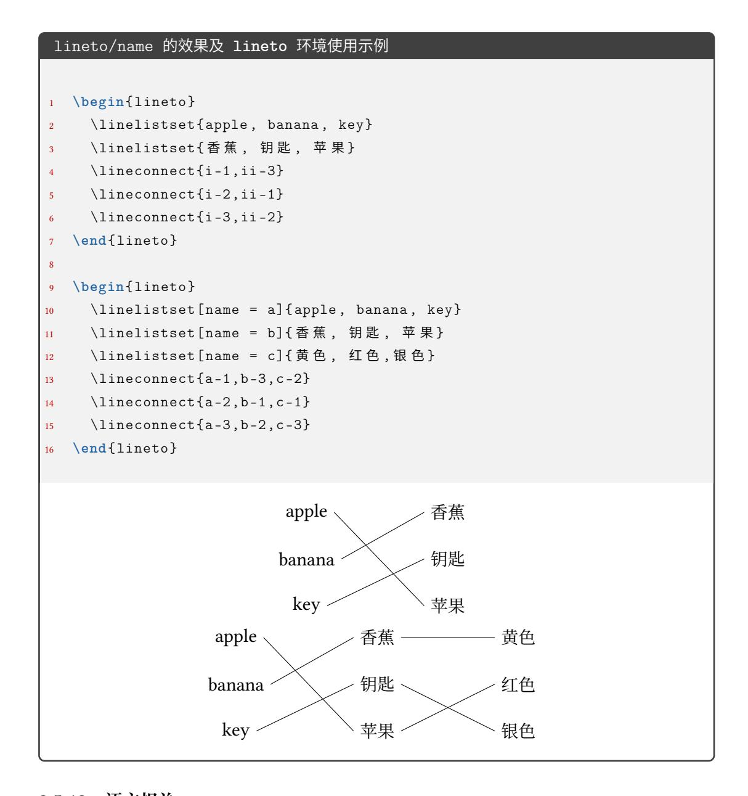

#### <span id="page-57-0"></span>**3.5.18 语文相关**

material = {〈键值列表〉} material/〈*key*〉 = 〈*value*〉 material Updated: 2022-07-24

> 该选项包含多个子项目。用于设置 **material** 环境。可以在 \examsetup 中使用,也可以在 **material** 环境的可选参数中使用。

title = 〈标题〉 material/title

**material** 环境的上方标题的 内容。可以为空或不写。 Updated: 2022-07-24

title-format = 〈格式〉 material/title-format

> **material** 环境的上方标题的 格式。默认为 \zihao{4}。 Updated: 2022-07-24

author = 〈作者〉 material/author

**material** 环境的上方作者的 作者名。可以为空或不写。 Updated: 2022-07-24

material/author-format

author-format = 〈格式〉

Updated: 2022-07-24

**material** 环境的上方作者的 格式。默认为 \small。

material/title-author-sep

title-author-sep = 〈弹性长度〉

Updated: 2022-07-24

**material** 环境的上方标题和作者之间的距离。默认为 2em。

material/format

format = 〈格式〉

Updated: 2022-07-24

**material** 环境内容的格式。默认为 \kaishu。

material/source

source = 〈来源出处〉

Updated: 2022-07-24

**material** 环境下方的来源出处。会新起一行并右对齐。

material/source-format

source-format = 〈格式〉

Updated: 2022-07-24

**material** 环境下方的来源出处的格式。

material/top-sep

top-sep = 〈弹性长度〉

New: 2022-07-24

**material** 环境和标题(如果有)的整体上方间距。默认为 0pt。

material/bottom-sep

bottom-sep = 〈弹性长度〉

New: 2022-07-24

**material** 环境的下方间距。默认为 0pt。

material/title-material-sep

title-material-sep = 〈弹性长度〉

New: 2022-07-24

**material** 环境和标题(如果有)的间距。默认为 0pt。

poem

poem = {〈键值列表〉}

poem/〈*key*〉 = 〈*value*〉

Updated: 2022-07-24

该选项包含多个子项目。用于设置 **poem** 环境。可以在 \examsetup 中使用,也可以在 **poem** 环境的可选参数中使用。

poem/title

title = 〈标题〉

Updated: 2022-07-24

**poem** 环境的上方标题的 内容。可以为空或不写。

poem/title-format

title-format = 〈格式〉

Updated: 2022-07-24

**poem** 环境的上方标题的 格式。默认为 \zihao{5}。

poem/author

author = 〈作者〉

Updated: 2022-07-24

**poem** 环境的上方作者的 作者名。可以为空或不写。

poem/author-format

author-format = 〈格式〉

Updated: 2022-07-24

**poem** 环境的上方作者的 格式。默认为 \small。

poem/title-author-sep

title-author-sep = 〈弹性长度〉

Updated: 2022-07-24

**poem** 环境的上方标题和作者之间的距离。默认为 2em。

poem/format

format = 〈格式〉

New: 2022-07-24

**poem** 环境内容的格式。默认为 \kaishu。

poem/align

align = **l**|*c*|*r*

New: 2022-07-26

**poem** 环境内容的对齐方式。l 表示左对齐;c 表示居中对齐;r 表示右对齐。

poem/top-sep

top-sep = 〈弹性长度〉

New: 2022-07-24

**poem** 环境和标题(如果有)的整体上方间距。默认为 0pt。

poem/bottom-sep

bottom-sep = 〈弹性长度〉

New: 2022-07-24

**poem** 环境的下方间距。默认为 0pt。

poem/title-poem-sep

title-poem-sep = 〈弹性长度〉

New: 2022-07-24

**poem** 环境和标题(如果有)的间距。默认为 0pt。

poem/type

type = *minipage*|**chinese**

New: 2022-07-25

**poem** 环境的类型(主要体现在页脚)。minipage 表示 **poem** 环境的页脚是基于 **minipage** 环 境形成的,脚注上方有横线,且两条脚注之间是分行的;chinese 表示脚注不分行,连着显示, 且最前方有 [注] 字(设计来源于"2021 年普通高等学校招生全国统一考试"语文真题卷)。

poem/zhu-circlednumber-base

zhu-circlednumber-base = *tikz*|**font**

New: 2022-07-26

在 poem/type = chinese 键值下,\zhu 的带圈数字的源。tikz 表示此时带圈数字基于 Ti*k*Z, font 表示此时带圈数字基于字体。

#### <span id="page-59-0"></span>**3.5.19 图文排版**

multifigures

multifigures = {〈键值列表〉}

Updated: 2022-08-28

multifigures/〈*key*〉 = 〈*value*〉

该选项包含多个子项目。用于设置 **multifigures** 环境。可以在 \examsetup 中使用,也可 以在 **multifigures** 环境的可选参数中使用。

multifigures/columns

columns = 〈*integer*〉

New: 2022-08-28

每行多少项。默认为 3。

multifigures/fig-pos

fig-pos = *top*|**above**|*bottom*|*below*|*left*|*right*

New: 2022-08-28

图片相对于标签的位置。top 和 above 同义、bottom 和 below 同义。

multifigures/top-sep

top-sep = 〈*dimension*〉

New: 2022-08-28

**multifigures** 环境上方额外弹性间距。默认为 1ex plus .5ex minus .5ex。

multifigures/bottom-sep

bottom-sep = 〈*dimension*〉

New: 2022-08-28

**multifigures** 环境下方额外弹性间距。默认为 0pt。

multifigures/align

align = *t*|*m*|**b**

New: 2022-08-28

图片和标签的整体对齐方式。t 表示顶部对齐、m 表示居中对齐、b 表示底部对齐。

```
xshift = 〈dimension〉
                     hshift = 〈dimension〉
                     yshift = 〈dimension〉
                     vshift = 〈dimension〉
multifigures/xshift
multifigures/hshift
multifigures/yshift
multifigures/vshift
```

New: 2022-08-28

图片和标签整体的水平和垂直的偏移量。xshift 和 hshift 同义,表示水平;yshift 和 vshift 同义,表示垂直。

```
label-xshift = 〈dimension〉
                           label-hshift = 〈dimension〉
                           label-yshift = 〈dimension〉
                           label-vshift = 〈dimension〉
multifigures/label-xshift
multifigures/label-hshift
multifigures/label-yshift
multifigures/label-vshift
```

New: 2022-08-28

标签相对图片的水平和垂直的偏移量。label-xshift 和 label-hshift 同义,表示水平; label-yshift 和 label-vshift 同义,表示垂直。

textfigure Updated: 2022-08-28

textfigure = {〈键值列表〉} textfigure/〈*key*〉 = 〈*value*〉

该选项包含多个子项目。用于设置 \textfigure 命令。可以在 \examsetup 中使用,也可以 在 \textfigure 命令的可选参数中使用。

textfigure/fig-pos

fig-pos = 〈*postion*〉

New: 2022-08-28

图片相对于文本的方位。方位可选参数见下列表,默认为 bottom-right。

- top:图片在文本上方
- bottom:图片在文本下方
- left:图片在文本左边,垂直中心对齐
- right:图片在文本右边,垂直中心对齐
- top-left:图片在文本的左上方
- top-center:图片在文本的上方,位于整行的水平中心
- top-right:图片在文本的右上方
- top-flushright:图片在文本的右上方,位于水平末端
- bottom-left:图片在文本的左下方
- bottom-center:图片在文本的下方,位于整行的水平中心
- bottom-right:图片在文本的右下方
- bottom-flushright:图片在文本的右下方,位于水平末端
- left-top:图片在文本左边,顶部对齐
- left-center:等价于 left
- left-bottom:图片在文本左边,底部对齐

• right-top:图片在文本右边边,顶部对齐

• right-center:等价于 right

• right-bottom:图片在文本右边,底部对齐

xshift = 〈*dimension*〉 hshift = 〈*dimension*〉 yshift = 〈*dimension*〉 vshift = 〈*dimension*〉 textfigure/xshift textfigure/hshift textfigure/yshift textfigure/vshift

New: 2022-08-28

图片和文本整体的水平和垂直的偏移量。xshift 和 hshift 同义,表示水平;yshift 和 vshift 同义,表示垂直。yshift 的默认值为 .5\baselineskip。

figure-xshift = 〈*dimension*〉 figure-hshift = 〈*dimension*〉 figure-yshift = 〈*dimension*〉 figure-vshift = 〈*dimension*〉 textfigure/figure-xshift textfigure/figure-hshift textfigure/figure-yshift textfigure/figure-vshift

New: 2022-08-28

图片相对于文本的水平和垂直的偏移量。figure-xshift 和 figure-hshift 同义,表示水 平;figure-yshift 和 figure-vshift 同义,表示垂直。

top-sep = 〈*dimension*〉 textfigure/top-sep

> \textfigure 命令上方弹性间距。默认为 0pt。 New: 2022-08-28

bottom-sep = 〈*dimension*〉 textfigure/bottom-sep

> \textfigure 命令下方弹性间距。默认为 1.5ex plus .5ex minus 0.5ex。 New: 2022-08-28

text-width = 〈*dimension*〉 textfigure/text-width

> 文本部分的 **varwidth** 宽度。默认为 \columnwidth。但有时需要手动输入 text-width = \columnwidth 才会变成整行,比如解答题。 New: 2022-08-28

figure-width = 〈*dimension*〉 textfigure/figure-width

> 图片部分的 **varwidth** 宽度。默认为 \columnwidth。 New: 2022-08-28

ratio = 〈比例〉 text-ratio = 〈比例〉 textfigure/ratio textfigure/text-ratio

New: 2022-08-28

图片部分占比。默认为 0.95。有时 1 的效果并不是整行,这主要和使用了 **varwidth** 环境有 关,此时建议改 text-width。

top = 〈*integer*〉 textfigure/top

fig-pos = left-top 时,图片顶部从文本的第几行开始排,效果和 wrapstuff 宏包的 top 键 值效果类似。 New: 2022-08-28

parindent = 〈*dimension*〉 textfigure/parindent

> 文本部分的缩进长度,默认为 2em。 New: 2022-09-18

#### <span id="page-62-0"></span>**3.5.20 数学-计算题排版环境**

calculations

calculations = {〈键值列表〉}

Updated: 2024-02-11

calculations/〈*key*〉 = 〈*value*〉

该选项包含多个子项目。用于设置 **calculations** 环境。可以在 \examsetup 中使用,也可 以在 **calculations** 环境的可选参数中使用。

calculations/index

index = 〈*integer*〉

New: 2024-02-11

第一个题干的序号。默认为 1。

calculations/columns

columns = 〈*integer*〉

New: 2024-02-11

每行多少项。默认为 2。

calculations/fig-pos

fig-pos = *top*|*above*|*bottom*|*below*|*left*|*right*|**left-top**

New: 2024-02-11

题干相对于标签的位置。top 和 above 同义、bottom 和 below 同义。

calculations/top-sep

top-sep = 〈*dimension*〉

New: 2024-02-11

**calculations** 环境上方额外弹性间距。默认为 1ex plus .5ex minus .5ex。

calculations/bottom-sep

bottom-sep = 〈*dimension*〉

New: 2024-02-11

**calculations** 环境下方额外弹性间距。默认为 0pt。

calculations/hsep calculations/vsep

hsep = 〈*dimension*〉 vsep = 〈*dimension*〉

New: 2024-02-11

Updated: 2025-11-07

hsep 表示题干之间的水平间距,vsep 表示题干之间的垂直间距。hsep 默认为 2em,vsep 默 认为 0em。

注:*v0.2.6* 起,内部实现优化了双列布局时的列宽计算(从 *0.3* 倍文本宽度调整为 *0.45* 倍),改善了排版效果。用户无需修改已有代码。

calculations/align

align = **t**|*m*|*b*

New: 2024-02-11

题干和标签的整体对齐方式。t 表示顶部对齐、m 表示居中对齐、b 表示底部对齐。

calculations/xshift

xshift = 〈*dimension*〉

calculations/hshift

hshift = 〈*dimension*〉

calculations/yshift calculations/vshift

yshift = 〈*dimension*〉 vshift = 〈*dimension*〉

New: 2024-02-11

题干和标签整体的水平和垂直的偏移量。xshift 和 hshift 同义,表示水平;yshift 和 vshift 同义,表示垂直。

calculations/label-xshift

label-xshift = 〈*dimension*〉

calculations/label-hshift

label-hshift = 〈*dimension*〉

calculations/label-yshift calculations/label-vshift

label-yshift = 〈*dimension*〉 label-vshift = 〈*dimension*〉

New: 2024-02-11

标签相对题干的水平和垂直的偏移量。label-xshift 和 label-hshift 同义,表示水平; label-yshift 和 label-vshift 同义,表示垂直。

# <span id="page-63-0"></span>**第 4 节 宏包依赖情况**

• expl3:提供 LATEX3 环境

• xparse:自定义命令环境

• filehook:给宏包打补丁

• ctexbook:exam-zh 基于的文档类

• etoolbox:补丁

• geometry:页面设置

• fontspec:字体设置

• xeCJK、xeCJKfntef:中文相关

• fancyhdr:页眉页脚

• lastpage:总页数

• amsmath、unicode-math:数学类宏包

• amsthm:提供 \qed 相关

• enumitem:列表

• tikz、tikzpagenodes:Ti*k*Z

• hyperref:超链接

• zref、zref-savepos:记录位置。

• ulem:下划线

• tcolorbox:彩框

• varwidth:"弹性"的 **minipage**

exam-zh-textfigure.sty 的宏包依赖:

• wrapstuff:图文混排(会自动检测,本地无此宏包则不会加载)

• tabularray:表格

• varwidth:"弹性"的 **minipage**

• graphicx:插图

# **第 5 节 主要更新**

- 2022.2 开发基本框架和主要功能(题干、选择题)
- <span id="page-64-0"></span>• 2022.4 开发字体模块
- 2022.6 开发密封线、草稿纸、评分框
- 2022.7 增加语文英语题型
- 2022.8 开发图文排版模版
- 2024.2 发布答案控制功能、计算题排版功能

# **第 6 节 参与开发**

- <span id="page-64-1"></span>• 如果您有任何改进意见或者功能需求,欢迎前往 gitee 仓库 issues 提交 issue
- 欢迎 fork 本项目,提 pr 的形式参与开发
- 建议阅读 muzimuzhi 写的 参与开发
- 参考阅读
  - **–** 知乎:[开发一个](https://zhuanlan.zhihu.com/typography-and-latex/) LaTeX [宏包需要多](https://gitee.com/ustctug/ustcthesis/wiki/%E5%8F%82%E4%B8%8E%E5%BC%80%E5%8F%91)少知识?
  - **–** The TeXbook 导读:从那头(多图杀猫的)狮子说起

# **第 7 [节 提问的智慧](https://www.zhihu.com/question/27017364/answer/34932199)**

<span id="page-64-2"></span>在使用 LATEX 的过程中,难免会遇到各种各样的问题,那么如何解决这些问题?很关键 的一点是学会提问。以下内容选自《提问的智慧》(简体中文版)(也非常推荐用户阅读全文, 此文不仅仅只对 LATEX 的使用有帮助,"提问的智慧"可用于方方面面)并结合 LATEX 做了相 应的调整。

# **7.1 为什么要学会提问**

在黑客的世界里,当您拋出一个技术问题时,最终是否能得到有用的回答,往往取决于 您所提问和追问的方式。

<span id="page-64-3"></span>现在开源(Open Source)软件已经相当盛行,您通常可以从其他更有经验的用户那里获 得与黑客一样好的答案,这是件好事;和黑客相比,用户们往往对那些新手常遇到的问题更 宽容一些。尽管如此,以我们在此推荐的方式对待这些有经验的用户通常也是从他们那里获 得有用答案的最有效方式。

首先您应该明白,黑客们喜爱有挑战性的问题,或者能激发他们思维的好问题。如果我 们并非如此,那我们也不会成为您想询问的对象。如果您给了我们一个值得反复咀嚼玩味的 好问题,我们自会对您感激不尽。好问题是激励,是厚礼。好问题可以提高我们的理解力,而 且通常会暴露我们以前从没意识到或者思考过的问题。对黑客而言,"好问题!"是诚挚的大 力称赞。

尽管如此,黑客们有着蔑视或傲慢面对简单问题的坏名声,这有时让我们看起来对新手、 无知者似乎较有敌意,但其实不是那样的。

我们不讳言我们对那些不愿思考、或者在发问前不做他们该做的事的人的蔑视。那些人 是时间杀手――他们只想索取,从不付出,消耗我们可用在更有趣的问题或更值得回答的人 身上的时间。我们称这样的人为失败者(撸瑟)(由于历史原因,我们有时把它拼作 lusers)。

我们意识到许多人只是想使用我们写的软件,他们对学习技术细节没有兴趣。对大多数 人而言,电脑只是种工具,是种达到目的的手段而已。他们有自己的生活并且有更要紧的事 要做。我们了解这点,也从不指望每个人都对这些让我们着迷的技术问题感兴趣。尽管如此, 我们回答问题的风格是指向那些真正对此有兴趣并愿意主动参与解决问题的人,这一点不 会变,也不该变。如果连这都变了,我们就是在降低做自己最擅长的事情上的效率。

我们(在很大程度上)是自愿的,从繁忙的生活中抽出时间来解答疑惑,而且时常被提问 淹没。所以我们无情地滤掉一些话题,特别是拋弃那些看起来像失败者的家伙,以便更高效 地利用时间来回答赢家(winner)的问题。

如果您厌恶我们的态度,高高在上,或过于傲慢,不妨也设身处地想想。我们并没有要求 您向我们屈服――事实上,我们大多数人非常乐意与您平等地交流,只要您付出小小努力来 满足基本要求,我们就会欢迎您加入我们的文化。但让我们帮助那些不愿意帮助自己的人是 没有效率的。无知没有关系,但装白痴就是不行。

所以,您不必在技术上很在行才能吸引我们的注意,但您必须表现出能引导您变得在行 的特质――机敏、有想法、善于观察、乐于主动参与解决问题。如果您做不到这些使您与众不 同的事情,我们建议您花点钱找家商业公司签个技术支持服务合同,而不是要求黑客个人无 偿地帮助您。

如果您决定向我们求助,当然您也不希望被视为失败者,更不愿成为失败者中的一员。 能立刻得到快速并有效答案的最好方法,就是像赢家那样提问――聪明、自信、有解决问题的 思路,只是偶尔在特定的问题上需要获得一点帮助。

总结来说,为了节约双方的时间,并能够高效地解决您的问题,您需要学会提问。

### **7.2 在提问之前**

在您提问之前,请先做到以下的事情:

- <span id="page-65-0"></span>1. 仔细完整地阅读过 exam-zh-doc.pdf(即现在的这个文档)
- 2. 完整读过 lshort-zh-cn,并且在其中进行过相关的查询
- 3. 尝试在 exam-zh 项目主页的 Wiki(gitee Wiki 或 github Wiki )中找到答案
- 4. 尝试在 exam-zh [项目主](https://ctan.math.illinois.edu/info/lshort/chinese/lshort-zh-cn.pdf)页的 issues(gitee issues 或 github issues )中找到答案(可 以点击"已完成"来查看以往的问题[和回答\)](https://gitee.com/xkwxdyy/exam-zh/wikis/Home)
- 5. 如果是某个命令或环境出问题了,自己检查是否按照规范正确使用该命令或环境,是 否少写或多写了括号等等;如果是某[宏包的命令或](https://gitee.com/xkwxdyy/exam-zh/issues)[环境,是否通过](https://github.com/xkwxdyy/exam-zh/issues) texdoc 〈宏包名〉 查看宏包手册来查询命令或环境的具体使用方式

6. 是否去搜索引擎搜索过相应的问题。推荐 LATEX 的 Stack Exchange 社区网站 LaTeX Stack Exchange。

# **7.3 在哪里提问以及如何提问**

如[果上述问题自查并](https://tex.stackexchange.com/)没有解决您的问题,那么您可以进行相应的提问了。

首先推荐在 exam-zh 项目的 issues(gitee issues 或 github issues )中新建 issue 进行 提问:

1. 使用有意义且描述明确的标题。标题简明扼要地概括出问题。一个好标题范例是目 标——差异式的描述,许多技术支[持组织就是这](https://gitee.com/xkwxdyy/exam-zh/issues)样[做的。在](https://github.com/xkwxdyy/exam-zh/issues)目标部分指出是哪一个或 哪一组东西有问题,在差异部分则描述与期望的行为不一致的地方。比如

在v0.2.3版本的 exam-zh 模板的正文使用了 \$f(x) > 1, 当且仅当 x > 0\$ 但是却没有显示中 文

要比"我公式里怎么没有显示中文啊"的标题要好得多。

编写目标——差异 式描述的过程有助于您组织对问题的细致思考。是什么被影响了, 只有这个中文还是还有其它部分不能显示?只有版本 0.2.3 无法显示还是以前显示 正常但是更新了新版本的模板后显示出问题?是只有我这边出问题了还是我的朋友 同学都有这个问题?

- 2. 精确地描述问题并言之有物。
  - 仔细、清楚地描述您的问题或 bug 的症状。
  - 描述问题发生的环境。操作系统,模板的版本,以及在问题出现前是进行了什么操 作?比如

在输入某代码前还是正常的,但是输入某代码后就编译出错

- 描述在提问前您是怎样去研究和理解这个问题的。您觉得问题出在哪里?您做了什 么措施去解决这个问题?
- 描述最近做过什么可能相关的硬件或软件变更。有没有换了电脑或更换了编译器
- 尽可能地提供一个可以重现这个问题的方法。比如自己检查出某行代码就是问题 所在,那么至少提供此行代码让别人能够复现这个问题,从而更好地帮助解决。

其次就是在模板的 QQ 群里提问(本文档封面脚注提供了群号)。但也确保您先进行了 自查。具体的细节也和上面在 issue 里提问类似。下面提供几个提问示例:

```
% 编译出错类型问题
安装的 LaTeX 发行版:TeXLive2024
电脑型号:macOS
模板版本:v0.2.3
问题描述:
 我打算输入一个数学公式,我输入下面这行代码前一些编译都是正常的:
  那么我们就得到了 x = \frac{1}{2}
报错信息是:
 Missing $ inserted.
 <inserted text>
```

```
可以复现问题的代码:
 \documentclass{exam-zh}
 \begin{document}
 那么我们就得到了 x = \frac{1}{2}
 \end{document}
目的:希望能显示二分之一这个分数
想法:我已通过手册中所说的方式进行了自查,但仍然没能解决问题,报错说少了一个 $ ,我觉得可能
   我没有正确地输入这个数学公式。
% 不知道如何实现某效果
安装的 LaTeX 发行版:TeXLive2024
电脑型号:macOS
模板版本:v0.2.3
问题描述:
 - 我打算输入一个数学公式,并且在其中输入中文
 - 我输入下面这行代码
  $f(x) > 1, 当且仅当 x > 1$
  但是里面并没有显示出"当且仅当"四个字
可以复现问题的代码:
 \documentclass{exam-zh}
 \begin{document}
 $f(x) > 1, 当且仅当 x > 1$
 \end{document}
目的:我希望能够显示出"当且仅当"四个字
想法:我已通过手册中所说的方式进行了自查,但仍然没能解决问题,我觉得缺少某个命令来输出这个
   公式中的中文,但我不知道是什么
% 格式更改需求
安装的 LaTeX 发行版:TeXLive2024
电脑型号:macOS
模板版本:v0.2.3
格式现状描述:
 solution 环境的"解答"有缩进
格式需求:
 希望可以增加键值控制这个缩进的有无。
可以复现问题的代码:
 \documentclass{exam-zh}
 \examsetup{
  solution/show-solution = show-stay
 }
 \begin{document}
 \begin{question}
  测试
 \end{question}
 \begin{solution}
  测试
```

\end{solution}

\end{document}

想法:我已通过手册中所说的方式进行了自查,但仍然不知道如何调整这个距离,希望能够编写一个键 值来控制这段距离

#### 将三个例子概括出模板:

*%* 编译出错类型问题

安装的 LaTeX 发行版:

电脑型号:

模板版本:v 问题描述:

报错信息是:

可以复现问题的代码:

目的:

自己的想法:

*%* 不知道如何实现某效果

安装的 LaTeX 发行版:

电脑型号:

模板版本:v

问题描述:

可以复现问题的代码:

目的: 想法:

*%* 格式更改需求

安装的 LaTeX 发行版:

电脑型号:

模板版本:v

格式现状描述:

格式需求:

可以复现问题的代码:

想法:

对于"不知道如何实现某效果"和"格式更改需求",如果用户无法通过文字准确描述的 话,请用纸笔将想要的效果画出来并提供越详细越好的说明。

无论是哪种情况,也可以顺便提供电脑的相应报错截图,但请不要用手机对电脑拍照。

# **第 8 节 关于模版作者和维护者**

zepinglee 开发了模版前期的大框架和主要功能(exam-zh-choices.sty、exam-zh-qu estion.sty、exam-zh-font.sty 等)。

xkwxdyy 和 ljguo 为模版的后期维护者。

[非常感谢](https://github.com/zepinglee)Sophanatprime、syvshc 和 Explorer 在开发中提供的帮助!